# akm improve — Workflow Reference

`akm improve` is the scheduled self-improvement loop that works through the assets with fresh feedback (or a scoped subset), invokes the reflection agent and the LLM distiller on each one, runs memory consolidation across the corpus, and then performs improve-owned maintenance passes such as memory inference. It is the primary mechanism for turning accumulated feedback into queued proposals: a rewrite (reflect) is planned only from negative feedback on an asset, or for an explicit ref, never from a positive signal and never on a proactive cadence. Proposals remain queued until explicit proposal review or the configured drain policy resolves them; events and resolved proposal rows provide the audit trail.

## Command surface

| Option | Type | Purpose |
|---|---|---|
| `[scope]` (positional) | `string` | Restrict the run to a single ref (`[bundle//]conceptId`), an asset type (`lesson`), or omit for all assets. |
| `--task` | `string` | Hint forwarded verbatim to the reflection prompt and agent. |
| `--dry-run` | `boolean` | Compute the plan from the existing index and analyze memory cleanup; emit no events, acquire no lock, call no model, and write nothing. |
| `--bundle` | `string` | The bundle the run improves and writes to, overriding `defaultWriteTarget` and the working bundle. It is the only bundle whose assets the run plans. |
| `--limit` | `number` | Cap the number of assets processed, taken from the salience ranking, highest first (refs routed to distill only come last). |
| `--timeout-ms` | `number` | Wall-clock budget for the entire run. Default: 7 200 000 ms (2 hours). |
| `--skip-if-locked` | `boolean` | If another improve owns the whole-run lock, return an exit-0 no-op result before triage, indexing, events, or sync. Without the flag, contention is a transient error (`IMPROVE_LOCK_HELD`, exit 75). |
| `--require-feedback-signal` | `boolean` | Turn the fallback lanes (high salience, proactive maintenance) off for the run: they only select and score assets, and a rewrite needs negative feedback. |

Injected function seams (`reflectFn`, `distillFn`, `ensureIndexFn`, `reindexFn`) replace production defaults in tests.

## High-level flow

```mermaid
flowchart TD
    A([akm improve invoked]) --> B[resolveImproveScope\nscope mode: all / type / ref]
    B --> C{dryRun?}
    C -- no --> E[Acquire whole-run lock\n$STATE/locks/&lt;stash&gt;/improve.lock]
    C -- yes --> COLLECT[collectEligibleRefs\nquery existing SQLite index, filter to stashDir]
    E --> E1{lock file held?}
    E1 -- yes, skip-if-locked --> SKIP[Return exit-0 no-op\nno triage, index, events, or sync]
    E1 -- yes, no flag --> ERR([throw TransientError: already running\nIMPROVE_LOCK_HELD, exit 75])
    E1 -- no / stale reclaimed --> PURGE[purgeGracedArchive\ngit-backed bundles only: delete archived\nretirement bytes past RETIRE_GRACE_DAYS]
    PURGE --> TRIAGE[Triage pending proposal backlog]
    TRIAGE --> ENSURE[ensureIndex primaryStashDir\nshared deadline signal]
    ENSURE --> COLLECT
    COLLECT --> CLEANUP_ANALYZE{memoryCleanup eligible?}
    CLEANUP_ANALYZE -- yes --> ANALYZE[analyzeMemoryCleanup\nscans .derived memories\nPRE-COMPUTED before dryRun check]
    CLEANUP_ANALYZE -- no --> D
    ANALYZE --> D{dryRun?}
    D -- yes --> DRY[Return dry-run result\nno lock, no events, no writes, no model calls\nincludes memoryCleanupPlan analysis]
    D -- no --> CONSOLIDATE
    EXTRACT[Session extract\nwhen the strategy enables it: queues proposals\nfrom coding-agent session transcripts]
    EXTRACT --> J[applyMemoryCleanup\nautonomy-gated: persist belief-state transitions\narchive prune candidates to .akm/memory-cleanup/archive/]
    J --> K[projectMemoryCleanup\ndrop archived refs from the planned set]
    K --> J2{anything archived or transitioned?}
    J2 -- yes --> J3[push memory-prune actions\nreindexFn: rebuild SQLite index]
    J2 -- no --> O[Pre-run validation sweep\ncheck file exists + lesson description\nschema repair when enabled]
    J3 --> O
    O --> P{validationFailures?}
    P -- yes --> P1[Log failures; refs that still fail\nare excluded from selection]
    P -- no --> L[Signal delta\nreflect: negative feedback, distill: any signal,\nnewer than the last ledger attempt\nand no hard ledger window]
    P1 --> L
    L --> L2[Fallback lanes\nproactive maintenance, high salience:\nonly retrieved or new material,\nscored and never planned]
    L2 --> M[scoreSalience\nsalience vector per ref: encoding, outcome, retrieval\nutility scores from SQLite seed the outcome term]
    M --> N[Sort by salience rank DESC, no-op dampened\ndrop refs missing on disk\napply --limit if set]
    N --> Q

    subgraph ASSET_LOOP["Per-asset loop"]
        Q{budget exhausted?}
        Q -- yes --> BUDGET([push error action\nbreak loop])
        Q -- no --> REFLECT

        subgraph REFLECT["reflectFn subprocess"]
            REFLECT_A[appendEvent: reflect_invoked] --> REFLECT_B[lookup ref in FTS index\nread asset file content]
            REFLECT_B --> REFLECT_C[readRecentFeedback\nbuildSchemaHints for lessons]
            REFLECT_C --> REFLECT_D[buildReflectPrompt]
            REFLECT_D --> REFLECT_E{RunnerSpec kind?}
            REFLECT_E -- sdk --> REFLECT_SDK[runExecution\nin-process SDK call]
            REFLECT_E -- spawn --> REFLECT_SPAWN[runExecution\nspawn agent CLI binary\ncaptured stdout]
            REFLECT_SDK --> REFLECT_F
            REFLECT_SPAWN --> REFLECT_F[parseAgentProposalPayload\nextract JSON from stdout]
            REFLECT_F --> REFLECT_G[createProposal\nstate.db proposals row\nsource: reflect]
            REFLECT_G --> REFLECT_H([return AkmReflectResult\nok or failure envelope])
        end

        REFLECT_H --> T{distillable memory?\nmemory ref, not derived or proposed,\nnot cooled by the signal delta}
        T -- no --> NEXT_ASSET
        T -- yes + memory without recent feedback
        --> SKIP_WEAK[push distill-skipped action\nappendEvent improve_skipped\nreason: memory_distill_requires_feedback]
        T -- yes --> DISTILL

        subgraph DISTILL["distillFn subprocess"]
            DISTILL_A[lookup ref file path] --> DISTILL_B[readEvents: feedback for ref\napply excludeFeedbackFromRefs filter]
            DISTILL_B --> DISTILL_C{proposalKind == auto\nAND promotion heuristic passes?}
            DISTILL_C -- yes --> DISTILL_PROMOTE[createProposal knowledge/ref\nsource: distill\nappendEvent: distill_invoked outcome=queued]
            DISTILL_C -- no --> DISTILL_D[callStage distill\nplan-resolved runner\n600 s default timeout]
            DISTILL_D --> DISTILL_E{call failed or empty output?}
            DISTILL_E -- yes --> DISTILL_SKIP[appendEvent: distill_invoked outcome=llm_failed\nreturn llm_failed result, no ledger row]
            DISTILL_E -- no --> DISTILL_F[stripMarkdownFences\nlintLessonContent or validateKnowledgeContent]
            DISTILL_F --> DISTILL_G{findings?}
            DISTILL_G -- yes --> DISTILL_FAIL[appendEvent: outcome=validation_failed\nthrow UsageError]
            DISTILL_G -- no --> DISTILL_J{quality gate judge:\nnovelty, non-redundancy, grounding}
            DISTILL_J -- pass --> DISTILL_H[createProposal lessons/slug-lesson\nor knowledge/slug\nsource: distill\nappendEvent: outcome=queued]
            DISTILL_J -- mean in the review band or grounding 2 with the mean not too low --> DISTILL_REVIEW[createProposal, gate decision deferred\nappendEvent: outcome=review_needed]
            DISTILL_J -- mean too low or grounding 1 --> DISTILL_REJECT[improve_ledger row, no proposal\nappendEvent: outcome=quality_rejected]
            DISTILL_PROMOTE --> DISTILL_RETURN
            DISTILL_SKIP --> DISTILL_RETURN
            DISTILL_H --> DISTILL_RETURN([return AkmDistillResult])
            DISTILL_REVIEW --> DISTILL_RETURN
            DISTILL_REJECT --> DISTILL_RETURN
        end

        SKIP_WEAK --> NEXT_ASSET
        DISTILL_RETURN --> NEXT_ASSET([completedCount++\nlog progress])
    end

    NEXT_ASSET --> Q

    BUDGET --> MAINT
    NEXT_ASSET -->|all assets done| MAINT

    subgraph CONSOLIDATE_SUB["akmConsolidate subprocess"]
        CON_A{selected strategy processes.consolidate.enabled?} -- no --> CON_NOOP([return empty result])
        CON_A -- yes --> CON_C[loadMemoriesForSource\nSQLite DB\nexclude .derived names]
        CON_C --> CON_D{memories == 0?} -- yes --> CON_NOOP
        CON_D -- no --> CON_E

        subgraph PHASE_A["Phase A — Plan generation (chunked)"]
            CON_E[split into configured chunks] --> CON_F[For each chunk:\nchatCompletion with frozen consolidate connection]
            CON_F --> CON_G[parse and validate ops:\npromote only]
            CON_G --> CON_H{2+ consecutive failures?} -- yes --> CON_ABORT[push warning, break]
            CON_H -- no --> CON_F
        end

        CON_ABORT --> CON_MERGE
        CON_G --> CON_MERGE[mergePlans: one promotion per\nsource memory, last chunk wins]
        CON_MERGE --> CON_DRY{dryRun?} -- yes --> CON_DRYRESULT([return planned ops, no writes])
        CON_DRY -- no --> PHASE_B

        subgraph PHASE_B["Phase B — Proposal emission"]
            PHASE_B_PRO[For each promote op:\nidempotency and coverage checks,\nthen emitProposal\nsource: consolidate]
        end

        PHASE_B_PRO --> CON_DONE

        subgraph PAIR_PASS["Pair pass (alpha.9), alongside Phase A/B"]
            PAIR_INIT[Initiators: changed-or-new memory,\nflat knowledge or lesson, in retrieval scope]
            PAIR_INIT --> PAIR_CAND[Candidates: k=5 nearest by stored vector,\nsame bundle + memory tier, cosine >= T_pair]
            PAIR_CAND --> PAIR_JUDGE[One LLM call per pair:\nconsolidate-pair.md, 6-label schema]
            PAIR_JUDGE --> PAIR_OUT{judge label}
            PAIR_OUT -- duplicate / subsumed / supersedes --> PAIR_GUARDS[Guards: hot capture, derived parent,\nrejected-pair match, same-run chain]
            PAIR_GUARDS --> PAIR_CONTINUITY[Continuity check R3:\nreplay retired asset's own queries,\nflag continuityRisk, never block]
            PAIR_CONTINUITY --> PAIR_PROPOSE[emitProposal: retire,\nsource: consolidate-pair]
            PAIR_OUT -- overlap / unrelated / contradicts --> PAIR_NOACTION[judged_no_action\nno 7-day timer — content change only]
        end

        PAIR_PROPOSE --> CON_DONE
        PAIR_NOACTION --> CON_DONE
        CON_DONE[return ConsolidateResult]
    end

    CONSOLIDATE --> CON_A
    CON_NOOP --> EXTRACT
    CON_DONE --> EXTRACT
    CON_DRYRESULT --> EXTRACT
    CON_ABORT2 --> MAINT

    subgraph MAINTENANCE["Improve-owned maintenance"]
        MAINT[runImproveMaintenancePasses] --> MI{memory refs queued for inference?}
        MI -- no --> FINAL
        MI -- yes --> MI_RUN[runMemoryInferencePass]
        MI_RUN --> MI_WRITE{wrote derived memories\nor marked parents?}
        MI_WRITE -- yes --> MI_REINDEX[reindexFn\nrefresh SQLite state after inference writes]
        MI_WRITE -- no --> FINAL
        MI_REINDEX --> FINAL
    end

    FINAL[Assemble AkmImproveResult\nschemaVersion: 2 and sync stash] --> UNLOCK[release whole-run lock\nfinally block]
    UNLOCK --> RETURN([return AkmImproveResult])
```



## Subprocess detail

### reflect (akmReflect)

`akmReflect` is the agent-invocation subprocess. It always emits a `reflect_invoked` event at entry, regardless of success or failure.

For `skills/*` refs, reflect also reviews related distilled lessons as consolidation evidence. When those lessons show strong, repeatable, factual guidance, the agent may propose promoting that guidance into long-term skill documentation, including companion reference docs under `skills/<skill>/references/*.md` via `knowledge/skills/<skill>/references/<topic>` refs.

**Internal steps:**

1. Emit `reflect_invoked` event via `appendEvent`.
2. Resolve asset content: look up the ref in the FTS index; read the file if found. Index miss is non-fatal.
3. Resolve the selected strategy's `reflect.engine`, falling back to `defaults.llmEngine`.
4. For skill refs, load the canonical derived lesson (`lessons/<type>-<name>-lesson`) plus any lesson files whose frontmatter `sources` cite the skill ref.
5. Build the reflection prompt via `buildReflectPrompt` (see Prompt shape below).
6. Dispatch the frozen `RunnerSpec` through `runExecution`. Unattended improve
   requires an LLM engine; explicit interactive uses may select an agent engine.
7. Parse stdout: `parseAgentProposalPayload` strips `<think>` blocks and code fences, then JSON-parses the output. Falls back to raw markdown detection if JSON parse fails.
8. Write the proposal: `createProposal(stash, { ref, source: "reflect", payload: { content, frontmatter } })`.

**What it writes:** one durable proposal row in `state.db`. It never writes asset files directly.

**Prompt shape (`buildReflectPrompt`):** The prompt instructs the agent to review the current asset content plus recent feedback signals and return a single JSON object `{ ref, content, frontmatter? }`. When `feedback` is empty and a ref is set, the prompt normally constrains the agent to schema/structural improvements only. The exception is `skills/*` refs with related distilled lessons: in that case the prompt allows substantive changes justified by those lessons and explicitly asks whether durable guidance should stay in `SKILL.md` or be promoted into a companion `knowledge/skills/<skill>/references/<topic>` doc. Lesson refs get a distinct goal framing ("distill what usage signals reveal") versus non-lesson refs ("produce an improved version"). The response contract (`RESPONSE_CONTRACT_JSON`) requires the agent to produce only the JSON object — no prose before or after. Non-empty feedback is always preceded by a caveat (`reflect-feedback-framing.md`) framing it as an unverified signal to investigate, not a fact to insert — feedback claims a model treated as ground truth were fabricating whole sections asserting details the asset never contained (#952). When feedback asks for information the asset lacks, the caveat's only instruction is to leave the section unchanged. It used to offer a `TODO: verify …` placeholder as an alternative, and a model inserted one into a memory from a feedback line reporting that `akm show` had failed; a later distill pass then built a lesson on that line (#999).

**Asset content cap:** the asset content section is capped to keep the prompt well under OS ARG_MAX when it travels through CLI argv (agent/SDK runners always use the flat `REFLECT_CONTENT_CAP`, 12 000 chars). The direct-LLM (`kind: "llm"`) path never touches argv, so its cap is instead computed from the resolved engine's `contextLength` (chars-per-token estimate × the reserve actually used by the rest of that prompt, measured per call rather than guessed), halved to reserve the other half of the usable context window for the model's response — a reflect rewrite returns a body roughly the size of the input, so the request must leave room to receive one — and never dropping below the flat floor. When content is truncated, a `REFLECT_TRUNCATION_MARKER` notice is appended; the output contracts explicitly forbid echoing that marker back, and `sanitizeReflectPayload` still detects a leaked marker in the response and defers the proposal for review (`reflect-truncation-leak`) rather than queuing it silently (#952).

### distill (akmDistill)

`akmDistill` is the bounded in-tree LLM subprocess. It never calls `runAgent`; it issues a direct HTTP chat completion through the configured LLM endpoint. Past the process gate it emits a `distill_invoked` event carrying the outcome.

**Internal steps:**

1. Validate the input ref shape (`parseRefInput`, `src/core/asset/resolve-ref.ts`).
2. Best-effort load asset content via `lookupFn` (defaults to indexer `lookup`).
3. Read feedback events via `readEvents({ ref, type: "feedback" })`. Apply `excludeFeedbackFromRefs` filtering before the LLM sees the events.
4. Memory promotion fast path: when `proposalKind` is `"auto"` or `"knowledge"` and `assessMemoryKnowledgePromotionCandidate` returns `promote: true`, create a `knowledge:` proposal immediately without an LLM call.
5. Resolve `improve.strategies.<selected>.processes.distill.engine` (falling
   back to `defaults.llmEngine`), then issue one bounded call.
   - Process gate: disabled if the selected strategy's `processes.distill.enabled` is `false`.
   - Hard timeout: 600 seconds by default, overridden by the resolved invocation timeout.
   - A timeout, an error or empty output returns an `llm_failed` result: a `distill_invoked` event with that outcome, no proposal and exit 0. It is not a ledger attempt, so the ref stays eligible. A disabled process returns `config_disabled` before any event.
6. Strip markdown fences and `<think>` blocks from the raw LLM output.
7. Validate: `lintLessonContent` for lesson proposals; `validateKnowledgeContent` for knowledge proposals. Failure emits `distill_invoked` with `outcome: "validation_failed"` and throws `UsageError`.
8. Quality gate (`processes.distill.qualityGate`, on unless disabled): one judge call, on distill's engine or the gate's own (`qualityGate.engine`), scores the lesson from 1 to 5 on **novelty**, **non-redundancy** and **grounding**, against the source body the lesson was generated from (frontmatter stripped, first 3000 characters). A lesson passes only when novelty and non-redundancy both score 4 or more; otherwise a mean of those two of 2.5 or more is `review_needed` and a lower mean is `quality_rejected`. Grounding asks whether the lesson is about what its source is about: 1–2 only for a different subject than the source, 3 for a lesson on the source's subject that goes beyond or corrects it (it may draw on feedback the judge is not shown), 4–5 when the source supports it. It is not part of the mean. A grounding score of 1 is `quality_rejected` whatever the mean is. This keeps a lesson about a tool error recorded as feedback — `akm show` failing on the ref — from being minted for a memory on an unrelated subject, which the other two criteria would pass or send to review (#999). A 2 is borderline, not a veto: a lesson on its source's subject that advises beyond the source can score 2, and scores move by about a point between runs even at temperature 0 (seen on a llama.cpp server). It goes to `review_needed` (reason `Borderline on grounding (2/5), routed to review: …`) even when the mean alone would pass it, but a mean that alone rejects it stays `quality_rejected`. A distill with no source to read (an unindexed ref distilled "from feedback signal alone") gives the judge an empty source, so its lesson is expected to be rejected as off-subject.
   - `quality_rejected` writes an `improve_ledger` row for the input (30-day distill rejection window) and a `distill_invoked` event carrying `score`, the per-criterion `criteria` and the `reason`. It mints no proposal.
   - `review_needed` mints a pending proposal stamped `deferred` / `quality-gate` for a human; the triage drain leaves it alone. It is the outcome for a non-passing mean of 2.5 or more (unless grounding is 1), a grounding score of 2 with a mean that does not reject, a judge that times out or returns something unparseable or incomplete, the optional fidelity check's contradiction (`processes.distill.fidelityCheck.enabled`, off by default; a lesson that contradicts its source reaches a human this way, not through grounding), and a heuristic lesson-quality finding (for example an invalid `description`), which is found before the judge is called.
9. Create proposal: `createProposal(stash, { ref: lessonRef, source: "distill", payload })`.
10. Emit `distill_invoked` event with `outcome: "queued"`.

**Lesson-ref derivation rule:** `lessons/<type>-<name>-lesson` where `<type>-<name>` is derived from the input ref with origin stripped and non-alphanumeric characters replaced by `-`. Example: `skills/deploy` → `lessons/skill-deploy-lesson`.

**What it writes:** one durable proposal row in `state.db`. Never writes asset files directly.

### consolidate (akmConsolidate)

`akmConsolidate` runs during preparation, before session extraction and the
per-asset loop.

**Gate:** returns immediately (no-op result) if the selected strategy's
`processes.consolidate.enabled` is false.

**Phase A — Plan generation:**

1. Load eligible non-`.derived` memory assets from the SQLite index, minus
   those the improve ledger holds: a memory judged within its 7-day revisit
   window and unchanged since, and a memory whose promotion was accepted or
   rejected and whose body has not changed since (see **Re-eligibility**
   below).
2. Chunk memories using the selected strategy's configured limit. For each
   chunk, call `chatCompletion` with the frozen consolidate LLM connection and
   `CONSOLIDATE_SYSTEM_PROMPT`, requesting a JSON plan of `promote`
   operations (the only op the schema offers; `merge`/`delete`/`contradict`
   were removed in 0.9.17-alpha.1 at `e82eec811` — they had run in
   production up to that commit, then were dropped because they cost
   thousands of completion tokens).
3. Parse and validate each op, then use `mergePlans` to deduplicate conflicts
   across chunks.

**Phase B — Proposal emission:**

1. For each promote op, perform idempotency checks and emit a reviewable
   proposal with `source: "consolidate"`. The checks run cheapest first and
   each records a skip reason: the same knowledge slug or a pending proposal
   for it, an identical body already in `knowledge/` or already pending, and
   then the coverage check (`consolidate/coverage.ts`, #998): the 20
   `knowledge/` docs in the same bundle nearest to the memory by stored vector
   (`getNeighborsByEntryId` scoped to that bundle's knowledge entries, the
   fetch depth the pair pass uses; no similarity floor, only that rank) are
   compared with it, and the memory is skipped as `dedup_covered_by_knowledge`
   when one of them holds at least half of its distinct 5-word shingles. A
   covering doc that ranks lower goes unseen, so the gate removes fewer
   proposals than the rule does against every knowledge doc (122 of 224
   rejected in #998's sample); its recall over the 20 is unmeasured. The rule
   and its evidence are in the module's header comment. With no stored vector
   (semantic search off, or the memory not yet indexed) the check does
   nothing and nothing throws.
2. Record what happened in the improve ledger (see **Re-eligibility** below):
   a memory the model judged and left alone, or that a skip reason turned
   away, gets a `judged_no_action` row; a promotion that failed to persist
   gets none, so the next run retries it.

**What it writes:**
- A durable row in the `proposals` table in `state.db` for each emitted
  `promote` op, partitioned by bundle path.
- An `improve_ledger` row for each memory the pass judged, except a promotion that failed to persist.

**Re-eligibility (#998):** the promote pass keys its ledger row by the source
memory (`memories/<name>`). A memory the model saw and left alone
(`judged_no_action`) or one with a pending proposal is revisited after 7 days,
or at once when the file is edited. An accepted or rejected promotion is
different: the row carries no `next_eligible_at`, and records the body hash
(`contentHash(_, "body")`, frontmatter excluded) the promotion was decided
against, taken from the proposal's `promotionSourceHash`. The memory is
selected again only when its current body hash differs, the same content-driven
rule the pair pass uses. A rejection is therefore no longer re-asked after 7
days, and the memory of an accepted promotion that is still on disk (O1 could
not archive it, or the same text was restored) is no longer eligible again at
once. A promotion decided before the hash was recorded (an older release's
proposal) has no hash to compare, and keeps the old windows. An expired
proposal still waits one day: nobody judged the text.

**Promotion retires its source (O1, alpha.9):** when an `akm proposal accept`
promotes a consolidate `promote` proposal — by a person or by triage
auto-promotion — it archives the source memory, and its `.derived` twin if
one exists, through the same path the pair pass uses below
(`archiveCleanupCandidate`, reason `promoted`, `successorRefs` the new
knowledge ref). A promotion no longer leaves a memory/knowledge duplicate
behind. This runs inside `promoteProposal`, not inside `akmConsolidate`
itself; a failure to archive the source only warns, it does not undo the
promotion.

### consolidate pair pass (alpha.9)

A second pass inside `akmConsolidate`, alongside Phase A/B above, over the
same enabled gate. It replaces nothing the promote pass does; it adds
duplicate, subsumed and superseding retirement, review-gated.

1. **Initiators:** memory (base or `.derived`), flat `knowledge/` or lesson
   assets in the bundle the run writes to, in the retrieval scope, and
   content-eligible: no prior pair-pass ledger row (source
   `consolidate-pair`, kept apart from the promote pass's `consolidate`
   rows), or a row whose recorded body hash differs from the asset's current
   one. Eligibility is purely content-driven — the ledger row carries no
   `next_eligible_at` timer at all for this source, so nothing here "expires"
   on a schedule; see step 5.
2. **Candidates:** each initiator's nearest neighbours by stored vector
   (`getNeighborsByEntryId`, fetching 20 and keeping the first 5 that clear
   every filter below — a few self/twin/bundle/tier misses in a naive top-5
   used to starve an initiator down to zero real candidates), same bundle,
   memory tier only (structured knowledge in subfolders is excluded), minus
   its own `.derived` twin or parent, at cosine >= `T_PAIR` (0.93). An
   initiator with no prior ledger row needs >= `BACKFILL_FLOOR` (0.95)
   instead, UNLESS it is new material — git first-added within
   `NEW_MATERIAL_DAYS` (7) — which judges at the ordinary `T_PAIR`: new
   content earns the same scrutiny as an edit, not the backlog's higher bar.
   "Older"/"newer" for the judge's own A/B labelling comes from one
   `git log --reverse -M --diff-filter=AR --name-status --format=@%ct` per
   run over the whole bundle (first-add time per path, following renames —
   an `A` sets a path's first-add, an `R` carries the old path's first-add
   to the new one, so a rename never misdates a file as newly added), not
   frontmatter or file mtime; mtime is only the fallback for a path git does
   not track, or a bundle with no `.git` directly inside it. At most
   `MAX_PAIRS_PER_RUN` (300) pairs a run, admitted a whole initiator at a
   time rather than by flat cosine rank across all of them: new-or-changed
   initiators first, then the existing backlog by its own best cosine, each
   admitted only if every one of its own candidate pairs fits in what
   remains of the 300 (first-fit, so a smaller initiator further down still
   fits when a larger one ahead of it does not) — an initiator with a
   pending-blocked pair is skipped entirely rather than spending any of the
   budget on a pair that cannot be judged yet.
3. **Judge:** one LLM call per pair (`src/assets/prompts/consolidate-pair.md`,
   the calibrated relation prompt, unchanged) through the consolidate
   process's own engine and concurrency, labelling the pair one of
   `duplicate`, `subsumed`, `supersedes`, `contradicts`, `overlap` or
   `unrelated`.
4. **Outcome:** `duplicate`, `subsumed` and `supersedes` mint one `retire`
   proposal (source `consolidate-pair`, its own generator — see below) for
   the side that does not survive — never a `captureMode: hot` memory, never
   a `.derived` memory whose parent still exists, never across bundles,
   never when either side already has a pending retire proposal (as the
   retired ref or its successor), and never retiring or reusing as a
   successor an asset already spent earlier in the SAME run (the durable
   half of this last guard is at accept time — step below). `contradicts`,
   `overlap` and `unrelated` are recorded `judged_no_action` with no
   proposal; `contradicts` is counted in the run report and stays a human
   decision.
5. **Ledger:** a row is written for an initiator only once every one of its
   own candidates was admitted this run (whole-initiator admission in step 2
   makes this an all-or-nothing membership check) AND actually resolved to a
   verdict — a same-run guard dropping a retire-worthy verdict (the chain
   guard in step 4), a failed mint, a failed or never-sent judge call, all
   count as unresolved, not judged — recording its current body hash and an
   outcome of `proposed` or `judged_no_action`. Neither outcome carries a
   timer for this source: only a later body-hash mismatch (step 1) makes the
   initiator eligible again. An initiator left with any candidate not
   admitted, not judged, or dropped gets NO row at all, so the next run
   reconsiders it rather than treating it as settled — real data: night 1
   alone judged 177 `duplicate` verdicts into only 59 proposals before this,
   the other 118 silently abandoned by the same-run chain guard.

   Because that "no row" case regenerates ALL of an initiator's candidate
   pairs next run — including ones already decided — a pair the owner
   already declined (rejected, or accepted then reverted) is never re-minted
   while both sides are unchanged: before the judge is ever called, the same
   ref pair and the same two content hashes (checked in both orientations,
   since it is the judge — not yet run — that would decide which side is
   "retired") are checked against every rejected or reverted
   `consolidate-pair` proposal on record, and a match is counted as a settled
   no-action (so the initiator's row still gets written this run) at no LLM
   cost at all. Those keys follow each proposal's current status: `akm
   proposal reopen` (#997) moves a rejected proposal back to `pending`, so it
   is no longer settled, and while it is pending a pair pass leaves both of its
   documents alone (step 4's pending-retire guard) instead of minting the
   pair a second time.

**Retire proposals (`akm proposal accept`/`revert`):** minted under their own
source, `consolidate-pair` — kept apart from the promote pass's
`consolidate` proposals so a bulk `accept`/`reject --generator consolidate`
never sweeps a retirement, and the reverse (`--max-diff-lines` counts a
retire proposal by its target's own current line count, not its empty
payload). Accepting one first confirms the decision is still fresh — the
successor still exists, and both sides' recorded body hashes still match
their current files — refusing cleanly, not partially applying a decision
something else (an intervening accept, possibly an A→B/B→C chain) made
stale. It then moves the retired asset (and its `.derived` twin) into the
existing `.akm/memory-cleanup/archive/` through the generalized
`archiveCleanupCandidate`, the one retirement encoding (D27) — never
`.akm/archive/`. A `supersedes` proposal first writes the supersede edge on
the older asset (`writeSupersededEdge`), then archives it. `akm proposal
revert` restores the archived file(s), and for the primary asset restores
the EXACT pre-retire bytes recorded at accept (`backupContent`) rather than
re-deriving "undo the edge" from the archived copy — so a pre-existing
human-written edge, YAML comments and key order all survive the round trip.
Accept records its full intent — `backupContent` and which file is about to
move — on the still-pending proposal before moving anything; a crash at any
point after resumes from that recorded intent (skipping whichever file a
tombstone scan shows an earlier, crashed attempt already archived under this
proposal's own id) rather than refusing it as stale or re-deriving
`backupContent` by guessing at what the archived copy would have been.
Revert works the other way for the same reason: each archive dir's own
tombstone already names its original and archived paths, so "original
present, archived copy missing" resumes as an earlier, crashed revert's own
work — UNLESS that original path's current content does not match the
`retirement.retiredContentHash` recorded at accept, meaning the path was
reused by an unrelated file since, which refuses instead of overwriting it.
Triage never auto-accepts a `retire` proposal, whatever `applyMode` says —
review reuses `akm proposal list --generator consolidate-pair` (S4: the
backlog is reviewed as its own list, not mixed in with every other
generator's proposals), `show`, `diff` (which renders a retirement as the
retired file's lines leaving under a `retire` header, with the pair's verdict
and a note that accept archives and revert restores — not as the file replaced
by a blank one, #997), and bulk
`accept --generator consolidate-pair` / `reject --generator
consolidate-pair`. A proposal carrying `continuityRisk` (below) is excluded
from that bulk accept, whatever the generator or `--yes` — visible inline in
`list`'s default output and in the text output of `show` and `diff` (the
specific failing/unverified queries, not just a count) — bulk reject is unaffected,
and a person can always accept one by id. A rejection is not final:
`akm proposal reopen <id>` puts a rejected retire proposal back to `pending`
(refused if the retired document, or the successor, changed since the pair was
judged, or if another pending retire proposal now involves either of them),
and accepting it then archives the file exactly as for any other retire
proposal.

### Retirement continuity check (rule R3)

Before the pair pass mints a `retire` proposal, it replays up to five of the
retired asset's own past `search`/`curate` queries
(`loadRetrievalQueries`, `src/commands/improve/retrieval-gate.ts` — the same
cleaned set the retrieval regression gate replays: `usableRetrievalQueries`
drops stash-README boilerplate and harness/tool envelopes
(`nonTaskInput`), pastes over 2,000 characters, and queries that are
duplicates once whitespace is collapsed, S3a) through akm's own search,
in-process — the same ranking a user gets, no LLM
(`src/commands/improve/consolidate/continuity-check.ts`). For every query
where the retired asset ranked in the top 10, the successor must rank in the
top 10 too — compared directly (N2): search itself returns at most the top
10 hits, so `rankOf` finding the successor among them or not is the whole
comparison, no generic rank-change-report abstraction needed. No recorded
queries means no check and no flag — and so does a retired/successor pair
whose bodies are
content-identical once whitespace is collapsed (S3b): search's own
content-dedupe (`src/indexer/search/db-search.ts`) already hides the
successor behind the retired asset for every such query, so a "successor
missing" finding there would not be a real risk, just that dedupe working
as designed.

A failing query does not block the mint — it flags. The proposal's
`retirement.continuityRisk` records the failing query count and, per failing
query, the retired asset's rank and the successor's (`null` when the
successor did not rank in the top 10 at all). This is the forgetting-safety
lane's old purpose (see below), now measured against search rank instead of
a stash-wide salience rank, and only at the moment an asset would actually
stop resolving.

A query that never ran (the search call threw) or that fell back to
keyword-only ranking (`mode: "fts-fallback"`) is "unverified" (S2): dropped
from the rank comparison — its hits are not the ranking a user actually
gets, so they are never compared — but tracked in
`retirement.continuityRisk.unverifiedQueries`, and on its own enough to set
`continuityRisk` even when every verified query passed. A search failure or
fallback must never look like "no risk found." `createContinuitySearch`
(`src/commands/improve/consolidate/continuity-check.ts`) is stateful across
one pair-pass run: the first `fts-fallback` it sees forces
`semanticSearchMode: "off"` for every later query that same run, so a down
embedding endpoint pays its failed-connection cost once per run, not once
per remaining query.

**The retired forgetting-safety lane.** Before alpha.9, `scoreSalience`
compared the whole stash's salience ranking before and after every improve
run, and a ref that fell from the top 200 to below 500 was injected into that
run's work set under `eligibilitySource: forgetting-safety`
(`applyForgettingSafety`, `improve_salience_rank_change` event). It was a
one-time cutover guard from the June 2026 ranking-formula change, running on
every run since. R5's 30-day event window (2026-08-30 to 2026-09-29, 47
`improve_salience_rank_change` events, 5 refs flagged across 4 runs) found no
marginal pick over the simpler baseline: 4 of the 5 flagged refs were also
picked that same run by the signal-delta lane, and the 5th has no
`reflect_invoked`/`distill_invoked` event in the retained history, but that
run's `improve_runs.plannedRefs` shows it, too, was planned under
`signal-delta` — just not reflected (a dispatch/budget limit that run, not a
lane-exclusive pick). All 5 flagged refs were signal-delta picks; zero were
ever forgetting-safety-only. It also protected `asset_salience.rank_score`,
which only improve itself ever read. Both the per-run comparison and the
injection are gone; so is `buildRankChangeReport` itself (N2 — the
continuity check compares ranks directly, and nothing else called it).
`forgetting-safety` stays a valid `eligibilitySource`/event-type value so
old proposals and events still decode.

### Archive purge sweep (step 8)

A retirement's archived bytes are not deleted when it is accepted — only the
tombstone (`cleanup.md`) resolves the ref from then on. `purgeGracedArchive`
(`src/commands/improve/memory/memory-improve.ts`) deletes them later,
deterministically and with no LLM, once at the very start of every
`akm improve` run — before index bootstrap, before triage. For a git-backed
bundle it walks `.akm/memory-cleanup/archive/`, and for every tombstone whose
`retiredAt` is more than `RETIRE_GRACE_DAYS` (30) days old AND whose
directory is entirely git-tracked and clean (one `git ls-files` plus one
`git status --porcelain -uall` per sweep, not per directory — B1), deletes
the archived asset file(s) under that tombstone's own directory — never
`cleanup.md` itself; git history keeps the bytes (D27). `.git` presence
alone does not prove a retirement was ever committed: `akm proposal accept`
only commits for a `kind: "git"` write target, and improve's own auto-sync
only stages the paths that same run wrote, so a directory with even one
untracked or modified file (the tombstone included) is left whole for a
later sweep rather than losing the only surviving copy of it. A
memory-cleanup family-prune archive (not a pair-pass retirement) has no
`retiredAt` in its tombstone at all, so this sweep never touches that older
archive class.

Every deleted file is journaled individually
(`src/core/write-provenance.ts`), the same mechanism the archive move itself
uses, so the end-of-run auto-sync commits the deletion in the run's own
commit. A bundle with no `.git` of its own is left untouched — there is
nothing to fall back on if a delete turns out to be wrong — and `akm health`
reports its archive's size and file count instead (`memory-cleanup-archive`
advisory, `src/commands/health/archive-usage.ts`), silent whenever the bundle
is git-backed or the archive is empty or absent.

### improve-owned maintenance

After consolidation completes, `akmImprove` runs maintenance steps that own the
remaining live-write memory/index artifacts previously coupled to indexing.

**Memory inference:**

1. Collect the memory refs that completed distill without being promoted to
   `knowledge:` in the same improve run.
2. Call `runMemoryInferencePass` with those refs.
3. If the pass writes derived memories or marks parents with
   `inferenceProcessed: true`, call `reindexFn({ stashDir })` so SQLite/search
   state reflects the new disk state before any later steps run.

### Proposal queue

`createProposal` is the write point used by reflect, distill, consolidate (promote), extract, schema repair and `akm proposal new`; the pair pass's retire proposals go through `createRetireProposal` instead. Both write the canonical `proposals` table in `state.db`; rows are partitioned by `stash_dir`, and pending/accepted/rejected/reverted are statuses on the same durable record (`akm proposal reopen` moves a rejected row back to pending). The retired `<stash>/.akm/proposals/` tree is neither read nor written.

**Logical proposal shape:**

```json
{
  "id": "<UUID>",
  "ref": "lessons/skill-deploy-lesson",
  "status": "pending",
  "source": "reflect",
  "sourceRun": "reflect-1715000000000",
  "createdAt": "2026-05-11T00:00:00.000Z",
  "updatedAt": "2026-05-11T00:00:00.000Z",
  "payload": {
    "content": "---\ndescription: ...\n---\n\nbody",
    "frontmatter": { "description": "..." }
  }
}
```

Two proposals can share the same `ref`; their UUID primary keys prevent collisions. Nothing in the loop scans the queue before it runs reflect or distill. The improve ledger keeps a stage from proposing the same ref again: an attempt that left a pending proposal is revisited after 7 days, or sooner when feedback newer than the attempt arrives (see **Ledger pre-filter (signal delta)** below).

## Scope restrictions

`akm improve` reads and writes one bundle, its write target: `--bundle`, else `defaultWriteTarget`, else the working bundle. The candidate set is that bundle's assets and nothing else, because every proposal is filed in the write target. An asset that another writable bundle owns is never planned: reflect would read it from its own bundle and the proposal would land in this one, either forking the asset as a `create` or overwriting this bundle's copy with content taken from the other's (#1000). A bare ref scope (`akm improve skills/x`) resolves inside the write target only, and distill's memory-to-knowledge promotion merges only with a doc that already exists there. To improve another writable bundle, select it with `--bundle team` or a bundle-qualified scope such as `team//skills/code-review`; a scheduled run therefore covers only its write target, and each other bundle needs its own scheduled `akm improve --bundle <name>` run. A dry run (`--dry-run`, `--plan`) resolves the bundle the way a live run does, with the working bundle starting from `AKM_BUNDLE_DIR` before `defaultBundle`, so it previews the bundle a live run improves. As a second line of defence, `createProposal` refuses a proposal whose `itemRef` names an asset owned by a different configured bundle than the queue's.

`akm improve` and `akm lint` only operate on writable bundle sources (sources with `writable: true`). Read-only sources (git, npm, website) are excluded from the candidate set before any other filtering; a read-only write target plans nothing.

## Ledger pre-filter (signal delta)

Every stage reads the improve ledger (`improve_ledger` in `state.db`, one row per `(stash_dir, ref, source)`; `source` is `reflect`, `distill`, `consolidate`, `consolidate-pair`, `extract`, `schema-repair` or `propose`, the last written by `akm proposal new` through `createProposal`) before it spends a model call, and writes it after. It replaced the per-stage cooldown constants and the event reads behind them (`reflect_invoked`, `distill_invoked`, `consolidate_completed`, rejected-proposal rows, `proposal_fingerprints`). When a ref may be tried again is decided in one place, `nextEligibleAt`, from the row's source and outcome: a rejected or quality-rejected attempt waits 14 days (reflect), 30 days (distill) or 7 days (any other source), an expired proposal 1 day, and an attempt that left a pending proposal, needed review, judged no action or changed nothing is revisited after 7 days; an accepted or failed attempt has no window. The consolidate pair pass and a decided consolidate promotion have no clock at all: their rows hold a body hash and the ref waits until its body differs (see **Re-eligibility** above). `rejected`, `quality_rejected` and `expired` are hard windows; every other window is a revisit cadence that a newer signal (new feedback, or for consolidation an edit) lifts (`isLedgerBlocked`).

**Selection.** Before the per-asset loop, `buildSnapshotManifest` reads the feedback events once and the ledger's `reflect` and `distill` rows once for every candidate, and `partitionBySignalDelta` (both in `preparation.ts`) sorts the refs. Reflect *passes* a ref when it has negative feedback, and distill when it has feedback carrying a signal or a note (a positive one included): dated within the last 30 days, newer than that stage's last ledger attempt for the ref, with no hard window blocking it. A positive or note-only signal never plans a reflect. Then:

- A ref that passes reflect is planned for the loop. If it does not pass distill, distill is skipped for it (a `distill-skipped` action and an `improve_skipped` event with reason `distill_no_new_signal`).
- A ref that passes only distill, and is a distill candidate, is planned distill-only.
- A ref with no in-window feedback and no reflect window is left to the fallback lanes (proactive maintenance and high salience), which pick only what retrieval returned or new material (see [Retrieval scope](../improvement.md#retrieval-scope)). The lanes only select and score: a ref they pick is not planned for reflect or distill, so improve does not rewrite assets on a proactive cadence.
- Every ref the loop does not take is counted in the plan's `signal` gate (or its `retrieval` gate, when the fallback lanes could not pick it for lack of usage evidence) and reported once, in aggregate, as an `improve_skipped` event (`no_new_signal`, `not_retrieved`).
- The loop's refs are ranked by salience (`scoreSalience` in `preparation.ts`, which also scores the fallback lanes' picks and computes each vector with `computeSalience` from `salience.ts`): encoding, outcome, and retrieval frequency and recency, discounted for file size, with a ref that was repeatedly skipped as a no-op ranked lower. Refs missing on disk are dropped, and `--limit` cuts the list: reflect-path refs first, then distill-only refs.

An explicit ref scope bypasses every gate. Consolidation, extract and schema repair read their own ledger sources in their own stages.

## Strategy process configuration

| Process | Config path | Controls |
|---|---|---|
| `distill` | `improve.strategies.<name>.processes.distill` | Enables distillation and selects its LLM engine/model/request overrides. |
| `consolidate` | `improve.strategies.<name>.processes.consolidate` | Enables consolidation and selects its LLM engine/model/request overrides. |

Improve process selection is resolved once by `resolveImprovePlan`; the plan
contains every process's frozen enablement, process config, and resolved runner.
LLM-only processes reject an explicit agent engine rather than falling through.

## Output shape

`AkmImproveResult` uses `schemaVersion: 2`, identifies the selected `strategy`,
and can report `ok: false` for terminated runs:

| Field | Type | Description |
|---|---|---|
| `scope` | `{ mode, value? }` | Resolved scope (`all`, `type`, or `ref`). |
| `dryRun` | `boolean` | Whether this was a dry run. |
| `guidance` | `string?` | Human-readable note about memory cleanup when memories are in scope. |
| `memorySummary` | `{ eligible, derived }` | Count of memory assets in scope and count of `.derived` ones. |
| `memoryCleanup` | `ImproveMemoryCleanupResult?` | Analysis (always present when eligible > 0) merged with apply results on a live run. Includes `archived`, `transitionLogPath`, `transitionLogEntries`, and `warnings`. |
| `plannedRefs` | `ImproveEligibleRef[]` | The post-filter, post-cleanup, salience-ranked refs that were (or would be) processed. |
| `actions` | `ImproveActionResult[]?` | Per-asset action records `{ ref, mode, result }`, where `mode` is an `ImproveActionMode` (`src/core/improve-types.ts`). A run emits `reflect` (a reflect proposal was queued), `reflect-skipped` (the strategy filtered the ref, or reflect declined it as `unsupported_type` or `no_change`), `reflect-guard-rejected` (a content-policy guard rejected the rewrite), `reflect-failed` (any other reflect failure, a quality rejection included), `distill` (the distill result, a validation failure included), `memory-prune` (a memory archived by cleanup), `memory-inference` (one `memories/_inference` row for the inference pass) and `error` (a loop failure other than a distill validation failure, or the wall-clock budget running out). `distill-skipped` is also emitted per ref, but `foldDistillSkipped` moves those rows into `distillSkipped` before the result is built, so none appears here. `reflect-cooldown` stays in the union for older rows and counters; nothing emits it. Absent on dry-run. |
| `distillSkipped` | `{ total, byReason, samples }?` | The folded `distill-skipped` actions: their total, a count per skip reason, and up to three sample refs per reason. Omitted when none were skipped. |
| `validationFailures` | `Array<{ ref, reason }>?` | Refs skipped due to pre-run validation failures (missing file, missing description). |
| `consolidation` | `ConsolidateResult?` | Result from `akmConsolidate`; omitted when `processed === 0` and no warnings. |
| `memoryInference` | `MemoryInferenceResult?` | Improve-owned post-consolidation memory inference telemetry. |

## Consolidation Skip Reason Taxonomy

The promote pass records a structured skip for each memory the model proposed to promote and the pass then declined to queue. They appear in `consolidation.skipReasons` of the improve result as `{ ref, skips: [{ op: "promote", reason }] }`, one entry per memory (`ConsolidateResult`, `src/core/improve-types.ts`); `emitPromotionProposal` in `src/commands/improve/consolidate.ts` is the only producer. Each skip also adds a warning line and moves the memory from `judgedNoAction` into the skip count, which keeps the accounting invariant `processed == promoted + judgedNoAction + Σ(skipReasons) + failedChunkMemories`. A skipped memory is written to the ledger as `judged_no_action` (revisited after 7 days, or at once on an edit), except a memory already promoted this run, which keeps the `proposed` row its proposal wrote, and `promote_create_failed`, which leaves no row so the next run retries it. The checks run in this order and the first that applies wins:

| Reason | Meaning |
|--------|---------|
| `promote_already_promoted_this_run` | Defensive guard: the memory was already promoted earlier in this run. `mergePlans` leaves one operation per memory, so it should not fire. |
| `promote_pending_proposal_exists` | A pending proposal already exists for the target `knowledge/<slug>`. Clears as triage drains the queue. |
| `promote_already_exists` | `knowledge/<slug>.md` already exists in the write target. Normal steady-state noise. |
| `promote_read_failed` | The memory file could not be read. |
| `promote_sanitization_failed` | The memory could not be re-serialized as an asset (an unbalanced code fence, missing or malformed frontmatter, frontmatter that is not valid YAML or not a mapping); the warning carries the reason code. |
| `promote_superseded` | The memory has `status: superseded`, which is not promotable knowledge. |
| `promote_source_too_small` | The memory's body is under 100 characters, too short to make useful knowledge. |
| `dedup_existing_knowledge` | A `knowledge/` doc in the write target already has an identical body (frontmatter aside). |
| `dedup_pending_proposal` | A pending consolidate proposal already carries an identical body. Clears as triage drains the queue. |
| `dedup_covered_by_knowledge` | A `knowledge/` doc among the 20 nearest to the memory in its bundle already holds at least half of its 5-word shingles (#998), so promoting it would queue a near-copy. |
| `promote_invalid_frontmatter` | The description it would use (the model's, else the memory's own) is missing or truncated. |
| `promote_dedup_window` | The target slug is a variant of a pending consolidate proposal's slug (dates, counters and word order folded), so it would queue a near-copy. |
| `promote_create_failed` | `createProposal` threw. The memory gets no ledger row, is retried next run, and is counted in `failedPromotions`. |

The dedup and eligibility reasons are ordinary; `promote_read_failed`, `promote_sanitization_failed`, `promote_invalid_frontmatter` and `promote_create_failed` point at a broken memory or a failing write and are worth a look when they recur. The consolidate `merge`, `delete` and `contradict` operations, and the `merge_*` and `captureMode_hot_refused` skip reasons that went with them, were removed in 0.9.17-alpha.1 (see Phase A above); the promote pass emits none of them. The pair pass (`consolidate-pair`) reports through its own result, not through `skipReasons`.

## Reviewed

Reviewed against `src/commands/improve/improve.ts`,
`src/commands/improve/reflect.ts`, and `src/commands/improve/distill.ts`.

**Checked:**
- Diagram branch ordering for lock vs. scope resolution
- Diagram branch ordering for dry-run early-return
- Validation sweep placement relative to the limit filter
- Consolidation placement relative to the per-asset loop
- Maintenance placement relative to consolidation and reindex
- Per-asset loop branch ordering (validation skip vs. budget check)
- Memory cleanup step sequencing (analyzeMemoryCleanup, applyMemoryCleanup, reindexFn)
- Strategy gating for consolidation (`improve.strategies.<name>.processes.consolidate.enabled`)
- Dry-run early-return node completeness
- Budget-exhausted break path
- Mermaid syntax and subgraph labels

**Fixed:**

1. **`analyzeMemoryCleanup` placement (critical accuracy bug):** The original diagram showed `analyzeMemoryCleanup` happening after lock acquisition (`E3 → F → G → H{memoryCleanup eligible?} → I`). In the actual code (`improve.ts` lines 251–253), `memoryCleanupPlan` is computed unconditionally before the `dryRun` check (line 259) and before lock acquisition (line 272). Moved `analyzeMemoryCleanup` to before the `dryRun?` diamond, and updated the DRY node to note it includes the pre-computed analysis.

2. **Per-asset loop (critical accuracy bug):** The loop no longer checks validation failures. A ref that fails the pre-run validation sweep (and is not repaired) is excluded before selection (`validationFailureRefs` in `runImprovePreparationStage`, `preparation.ts`), so the first check in `runImproveLoopStage` is the wall-clock budget. The diagram's `S{ref in validationFailures?}` branch, which had also reused the `SKIP` node id of the lock-held exit, is gone.

3. **Preparation order (accuracy bug):** `runImprovePreparationStage` (`preparation.ts`) runs consolidation, session extract, memory cleanup (`applyMemoryCleanup`, `projectMemoryCleanup`, then the `memory-prune` actions and `reindexFn` when something was archived), the validation sweep and schema repair, and only then selection (signal delta, fallback lanes, salience ranking, disk check, `--limit`). The diagram follows that order.

4. **Post-loop maintenance placement (accuracy bug):** Improve now runs memory inference after consolidation, not before it (the same fix originally applied to graph extraction, retired in 0.9.17-alpha.9). The workflow now documents the maintenance stage and the reindex after inference writes.
