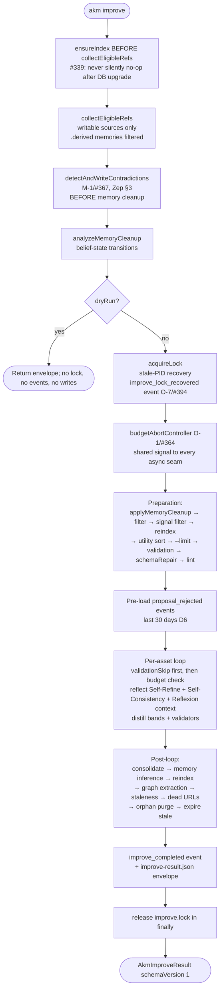
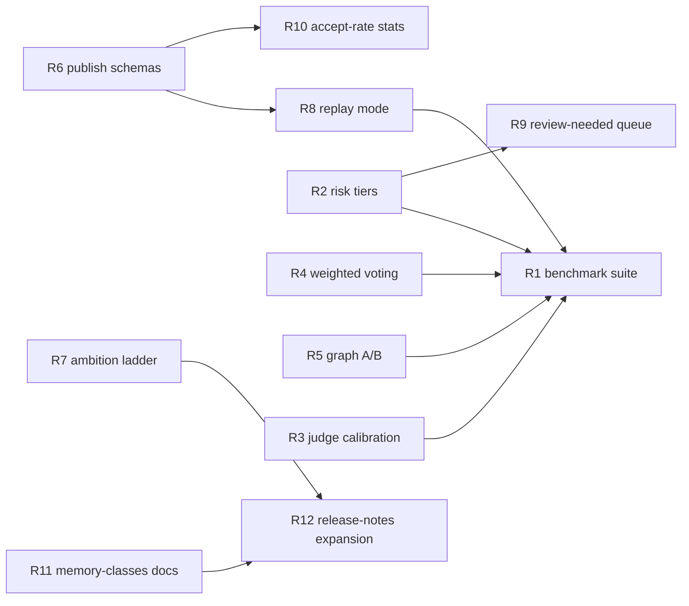

> **ARCHIVED 2026-07-05 (meta-review 14).** Historical May-2026 analysis of the 0.8.0-era pipeline.
> Superseded by `docs/design/improve-self-learning-analysis.md` (canonical 2026-07-01). Git history is the recovery path.

# akm Improve Pipeline — Audit, Roadmap, and Recommended Next Steps (`release/0.8.0`)

> **Historical note (May 2026):** This document references the bash
> analysis toolkit at `scripts/improve-stats/` and its companion doc
> `docs/improve-stats.md`. Both were removed when the same metrics were
> first-classed onto `akm health` (see
> [health-command-enhancements.md](health-command-enhancements.md)).
> Treat any operator-tooling references below as pointing at
> `akm health --since N`, `akm health --detail per-run`, and
> `akm health --window-compare`.

> This document is the consolidated output of two external critical reviews
> and a direct code audit of the `release/0.8.0` branch. It serves three
> purposes: (1) preserve the corrections to the original external review,
> which was written without branch-level visibility; (2) validate the
> follow-up external review, which inherits those corrections and adds new
> high-leverage critiques; and (3) translate the combined findings into a
> single, prioritized, code-grounded roadmap for the improvements `akm`
> needs next. Where claims could be verified directly against the code on
> `release/0.8.0`, they are. Where they remain unverified, that limitation
> is called out in place.

## 1. What this document supersedes

There are now three reports in play:

1. **Original external review (May 2026).** Written without direct
   inspection of `release/0.8.0`. Treated the README's seven-layer framing
   as forward-looking design. Concluded that improvement was "design intent
   ahead of implementation" and that `reflect.ts`, `propose.ts`, `distill.ts`
   were not visible as top-level modules.
2. **Code-grounded correction (this branch, prior revision).** Verified
   against `release/0.8.0` source. Established that the improve pipeline is
   a first-class subsystem with dedicated modules, literature-grounded
   inline citations, structured run envelopes, and operator tooling. Many
   of the original review's "missing" findings were artifacts of incomplete
   inspection.
3. **Follow-up external review.** Acknowledged the corrections, agreed the
   architecture is concrete and credible, and shifted the critique to four
   higher-leverage issues: measured evidence, risk-tiered acceptance,
   judge self-confirmation, and consensus-vs-correctness. It also proposed
   an "ambition ladder" framing and a more specific benchmark task list.

This document is the consolidated view. It validates the follow-up review's
new contributions, preserves the code-grounded corrections of the original
review, and reorganizes the combined material as a roadmap.

## 2. Verified state of the improve pipeline on `release/0.8.0`

Every claim in this section was checked against the source on the
`release/0.8.0` tip (commit `cea9d5e`).

- **Implementation footprint.** Dedicated CLI modules: `improve.ts`
  (2 664 LOC), `reflect.ts` (1 292 LOC), `distill.ts` (1 328 LOC),
  `consolidate.ts` (1 672 LOC), `propose.ts` (328 LOC),
  `proposal.ts` (329 LOC). Core modules: `proposals.ts` (1 230 LOC),
  `memory-improve.ts` (991 LOC), `memory-belief.ts`,
  `memory-contradiction-detect.ts`, `proposal-validators.ts`,
  `proposal-quality-validators.ts`, `events.ts`. Subsystems:
  `indexer/memory-inference.ts`, `indexer/graph-extraction.ts`,
  `llm/feature-gate.ts`, `llm/memory-infer.ts`, `llm/graph-extract.ts`.
- **Pipeline structure.** `akmImprove` runs (a) preparation
  (ensureIndex → collectEligibleRefs → contradiction detection →
  memory cleanup analysis → lock acquisition with stale-PID recovery →
  budget abort controller → validation sweep → schema repair → lint),
  (b) per-asset loop (reflect with Self-Refine + Self-Consistency +
  rejected-proposal context, then distill with judge bands and validation),
  and (c) post-loop maintenance (consolidate, memory inference, reindex,
  graph extraction, staleness detection, dead-URL checks, orphan purge,
  stale-proposal expiry). See `docs/technical/improve-workflow.md` for the
  full flow.
- **Proposal substrate.** All generated changes flow through
  `<stashRoot>/.akm/proposals/<UUID>/proposal.json`. Statuses are
  `pending`, `accepted`, `rejected`, `reverted`. `PROPOSAL_SOURCES` is a
  typed allow-list with `AUTOMATED_PROPOSAL_SOURCES` requiring `sourceRun`
  for W3C PROV-DM 2013 traceability. Promotion runs through
  `validateProposal` + `runProposalValidators` before
  `writeAssetToSource`.
- **Memory model.** Three classes are separated in code: immutable events
  in `state.db`, derived memories with a six-state belief lifecycle
  (`active` → `asserted` → `deprecated` → `superseded` → `contradicted` →
  `archived`), and queued proposals outside the asset tree.
  `analyzeMemoryCleanup` archives prune candidates with provenance;
  `applyMemoryCleanup` writes a belief-state transition log;
  `akmConsolidate` writes `.akm/consolidate-journal.json` before any
  mutation for crash recovery and `.akm/consolidate-backup/<timestamp>/`
  before merge or delete.
- **Research grounding.** Inline citations next to implementing code paths
  for Reflexion (arXiv:2303.11366), Self-Refine (arXiv:2303.17651),
  Self-Consistency (arXiv:2203.11171), ExpeL (arXiv:2308.10144), STaR
  (arXiv:2203.14465), Voyager (arXiv:2305.16291), CoALA (arXiv:2309.02427),
  Zep / Graphiti (arXiv:2501.13956), mem0 (arXiv:2504.19413), A-MEM
  (arXiv:2502.12110), MemOS (arXiv:2507.03724), MemRL (arXiv:2601.03192),
  MT-Bench (arXiv:2306.05685), CRITIC (arXiv:2305.11738), CoVe
  (arXiv:2309.11495), G-Eval (arXiv:2303.16634), PRM / ORM
  (arXiv:2305.20050), Constitutional AI (arXiv:2212.08073), W3C PROV-DM 2013.
- **Observability substrate.** Per-run JSON envelopes at
  `<stash>/.akm/runs/<run-id>/improve-result.json` (`schemaVersion: 1`);
  events table in `state.db` with monotonic AUTOINCREMENT cursor for
  `--since` resumption; events emitted during improve include
  `improve_invoked`, `reflect_invoked`, `reflect_completed`,
  `improve_reflect_outcome`, `distill_invoked`, `consolidate_invoked`,
  `propose_invoked`, `feedback`, `promoted`, `rejected`,
  `proposal_rejected`, `proposal_creation_rejected`,
  `proposal_orphan_purge`, `improve_skipped`, `improve_completed`,
  `improve_failed`, `improve_lock_recovered`.
- **Operator tooling.** `scripts/improve-stats/` contains `runs-list`,
  `run-show`, `runs-trend`, `actions-breakdown`, `lint-current` (shell +
  `jq`, no extra dependencies), with `docs/improve-stats.md` as the user
  guide and `scripts/improve-stats/README.md` documenting the diagnostic
  patterns the toolkit was extracted from.
- **Test coverage.** 394 test files total; 26 directly target the improve
  loop including `tests/contracts/improve-knowledge-authority.test.ts`,
  `tests/contracts/reflect-propose-envelope.test.ts`, and
  `tests/contracts/v1-spec-section-11-proposal-queue.test.ts`. Subprocess
  seams (`reflectFn`, `distillFn`, `memoryInferenceFn`,
  `graphExtractionFn`, `ensureIndexFn`, `reindexFn`,
  `stalenessDetectionFn`) are injectable for deterministic testing.
- **Package metadata.** `package.json` on `release/0.8.0` reports
  `"version": "0.8.0"`.

The earlier review's "design ahead of implementation" framing is therefore
inverted: implementation is currently ahead of public-API-grade
documentation in several places.

## 3. What the follow-up external review adds

The follow-up review accepts the corrected picture and contributes four
high-leverage critiques plus several specific recommendations. Each is
validated below against the code.

### 3.1 "Measured evidence is the largest gap" — validated and absorbed

The follow-up review's strongest single claim. Verified: although the
project has run envelopes, an events table, a stats toolkit, and 26
improve-pipeline tests, it does not publish (a) a versioned task suite,
(b) frozen golden traces, (c) head-to-head numbers against Mem0 / Zep /
Letta / vanilla long-context, or (d) per-source acceptance-rate
trends. The infrastructure exists; the public evidence does not. This
becomes Roadmap item R1.

### 3.2 "Auto-accept needs sharper policy boundaries" — validated, expanded

Verified: `--auto-accept` is a single integer threshold (default 90) that
applies uniformly across all proposal sources and asset types.
`PROPOSAL_SOURCES` distinguishes provenance but not risk. The follow-up
review's risk-tier proposal (Tier 0 mechanical → Tier 3 behavioral) is
additive and not currently in code. The `review_needed` distill outcome
(`D-5 / #388`) already routes some uncertainty to human review, but the
band is a property of distill judges, not a property of the proposal
itself. This becomes Roadmap item R2.

### 3.3 "LLM judges can become self-confirming" — validated, narrower than implied

Verified: `akmDistill`'s quality judge runs through `tryLlmFeature` with
the same provider configuration used elsewhere, and `akmReflect`'s
Self-Refine inner loop shares the agent profile that produced the original
draft. Mitigations already in place are non-trivial — bounded
`maxRefineIters` (cap 3) with early-stop on identical content, three-band
MT-Bench-style outcomes, rejected-proposal verbal-RL context, content
validators independent of the judge LLM, lesson-lint findings, and the
ExpeL-cited "differential evidence" requirement for rule admission. The
fair conclusion is that judge self-confirmation is a real risk but it is
not unguarded; the next step is **measurement**, not new mitigations. This
becomes Roadmap item R3.

### 3.4 "Consensus is not truth" — validated for Self-Consistency Jaccard

Verified: `src/commands/improve.ts` uses Jaccard token overlap to pick the
Self-Consistency winner. That is a cheap stabilizer, not a correctness
signal. The follow-up review's recommendation is to keep Jaccard as a
fallback but prefer domain-specific scoring where available (validators
for lessons, schema checks for workflows, retrieval precision for
knowledge, human acceptance as delayed reward). This becomes Roadmap item
R4.

### 3.5 "Measure graph contribution explicitly" — validated, gap is real

Verified: `runGraphExtractionPass` runs by default in `akm improve`
(feature flag default `true` in `FEATURE_DEFAULTS`); graph rows boost
search ranking via `graph-boost.ts`; no benchmark harness in tree
compares retrieval / contradiction detection / staleness performance with
graph extraction on versus off. This becomes Roadmap item R5.

### 3.6 "Ambition ladder" — validated as a documentation gap

Verified: no doc currently names the staged ambition. The follow-up
review's five-stage ladder (knowledge reuse → operational learning →
memory evolution → policy/scaffold adaptation → recursive
self-improvement, explicitly out of scope for v1) is a useful
expectation-setter. This becomes Roadmap item R6.

### 3.7 Public schema contracts — validated, partially absorbed

The follow-up review's recommendation to publish `event-schema.md` and
`run-envelope-schema.md` is consistent with the prior code-grounded
recommendation. The schemas already exist in code (`EventType` union in
`src/core/events.ts`; `AkmImproveResult` and `improve_completed` metadata
in `src/commands/improve.ts`) but are not promoted to a public surface.
This becomes Roadmap item R7.

### 3.8 Restored Letta comparison row — validated as a fair peer

The follow-up review re-includes Letta as a peer in the stateful-agent /
memory-management category. Letta differs from `akm` in being a runtime
agent server rather than a portable CLI knowledge substrate. The
comparison row is preserved in §5 below with the appropriate caveat.

### 3.9 Two follow-up-review claims pushed back on

Two claims in the follow-up review overstate the gap:

- **"Documentation appears behind implementation"** is too broad.
  `docs/technical/improve-workflow.md` is 381 lines reviewed against
  `improve.ts`/`reflect.ts`/`distill.ts`; `docs/features/improvement-loop.md`
  is the operator surface; `docs/improve-stats.md` and the toolkit README
  document analysis patterns. The real gap is in *public-API-grade schema
  docs* for events and run envelopes, not in architectural docs. The
  roadmap reflects this narrower scope.
- **"Auto-accept threshold complicates posture"** undersells the existing
  `review_needed` distill band and the validator chain. The right fix
  is risk-tiered acceptance (R2), not removing auto-accept.

## 4. Improve pipeline at a glance

The structure verified against `release/0.8.0`:

## 5. Comparison to memory and self-improvement systems

| System | Primary object improved | Update mechanism | Feedback grounding | Train/inference | Human gate |
|---|---|---|---|---|---|
| `akm` 0.8.0 | Assets, belief-state memories, knowledge promotions, graph artifacts, proposal queue | Reflect (agent + Self-Refine + Self-Consistency), Distill (in-tree LLM + judge bands), Consolidate (LLM plan + journaled write), memory inference, graph extraction | Feedback events, retrieval counts, rejected-proposal verbal context, validators, contradiction edges, MemRL utility | Inference-time orchestration; no model weights touched | Structural (validators + accept/reject) but uniform auto-accept threshold — see R2 |
| mem0 | Long-term conversational memory | Extract / consolidate / retrieve | Conversation stream + memory benchmarks | Inference-time memory layer | Embedded in app policy |
| Zep / Graphiti | Temporal knowledge graph | Dynamic graph synthesis with temporal edges | Conversations + business data | Inference-time memory layer | Embedded in app policy |
| Letta | Stateful agent memory and runtime | Agent state and memory management | Agent interactions | Runtime agent framework | Depends on deployment |
| Reflexion | Agent behavior across trials | Verbal reflection in episodic memory | Environment / task feedback | Inference-time across episodes | Optional |
| Self-Refine | A model output | Iterative self-critique | Internal | Inference | None by default |
| ExpeL | Reusable experiential knowledge | Extract insights, recall later | Training-task experience | Inference-time, no weights | Research-controlled |
| STaR | Reasoning behavior | Generate/filter rationales, fine-tune | Correct-answer labels | Training-time bootstrapping | Research-controlled |
| Voyager | Skill library and task behavior | Generate executable skills, improve from env errors | Environment feedback | In-context lifelong learning | Low during run |
| STOP | Improver scaffold | Recursive program improvement under utility | Utility function | Recursive scaffold | Limited |

The honest framing: `akm` is in the **knowledge-operations** lane, closest
to Mem0 / Zep / Letta but broader in scope (assets, workflows, memories,
proposals, graph). It is intentionally not in the recursive
self-improvement lane. The next step is empirical defensibility within
the lane it occupies.

## 6. Strengths preserved from both reviews

- **Correct object of improvement.** `akm` improves the agent environment,
  not the model. That keeps the loop portable across harnesses and models.
- **Proposal-first design.** No generated change becomes operational truth
  without flowing through `<stash>/.akm/proposals/<UUID>/proposal.json`
  and surviving `validateProposal` + `runProposalValidators`.
- **Three-class memory separation in code.** Immutable events,
  belief-state memories, queued proposals. Forgetting is a state
  transition, not an erasure.
- **Multi-pass post-loop maintenance.** Consolidation, memory inference,
  graph extraction, staleness detection, dead-URL checks, orphan
  proposal purge, stale-proposal expiry. Knowledge-base hygiene, not
  just reflection.
- **Inline research grounding.** Each cited paper has a corresponding
  code path, not just a doc mention.
- **Observability substrate.** Run envelopes + events table + stats
  toolkit are already wired; benchmarking infrastructure is the next
  layer up, not foundational rework.

## 7. Weaknesses requiring action

Each item below is the rationale for a roadmap entry in §8.

- **W1. No public versioned benchmark suite.** Telemetry exists; reproducible
  evidence does not.
- **W2. Auto-accept is policy-flat.** A single threshold treats Tier 0
  mechanical repairs the same as Tier 3 behavioral changes.
- **W3. LLM judges share priors with generators.** Judge independence is
  not measured.
- **W4. Self-Consistency uses Jaccard.** A cheap stabilizer treated, by
  default, as a correctness signal.
- **W5. Graph contribution is unmeasured.** Default-on feature with no
  on/off comparison harness.
- **W6. Schemas are private.** Event types and run envelopes are
  internally disciplined but not promoted to a stable public contract.
- **W7. Ambition is not staged.** No doc names what `akm` does and does
  not claim to be.
- **W8. Risk-tier metadata is absent.** Proposals are typed by source
  but not by risk; operator review queues cannot filter by impact class.
- **W9. Accept-rate-per-source is not surfaced.** PROV-DM provenance is
  written but not displayed as an operator metric.
- **W10. 0.8.0 release notes underweight late-cycle changes.** Several
  behavioural changes that landed before release (improve-owned
  maintenance, lower distill cooldown, MEMORY.md budget,
  contradiction-before-cleanup, three-band distill, memory→knowledge
  promotion, write-guard, `improve_lock_recovered`) need a more
  prominent operator-facing summary.

## 8. Consolidated roadmap

Items are listed in recommended priority order. Each item names the
weakness it addresses, the deliverable, the existing code it builds on,
and a rough effort estimate (S = ≤ 1 day, M = a few days, L = a sprint).

### R1. Publish a versioned benchmark suite with frozen golden traces (W1)

**Effort:** L. **Home:** `itlackey/akm-bench` plus thin runner in this repo.

The single biggest credibility multiplier. The suite should cover:

- **Memory retention.** A useful memory remains retrievable after
  consolidation and cleanup.
- **Contradiction handling.** Newer evidence supersedes older claims
  without destroying audit history.
- **Lesson distillation.** Repeated success/failure feedback produces a
  compact, useful lesson that passes admission heuristics.
- **Negative transfer.** A specialized lesson does not damage unrelated
  tasks.
- **Staleness detection.** Outdated repo/layout assumptions surface
  through the staleness pass.
- **Proposal quality.** Generated proposals pass either human review or
  deterministic validators above a baseline rate.
- **Retrieval precision.** Graph / utility scoring improves useful asset
  selection (this is the data source for R5).
- **Replay determinism.** A frozen run envelope reproduces the same
  state transitions (data source for R8).

Each task should ship with frozen LLM I/O traces so re-runs do not pay
for tokens. The deliverable is a `bun run bench:improve` command that
reports per-task pass/fail and rolls up to a single regression flag if
any metric drops more than a configured delta.

### R2. Risk-tier proposal classes and gate auto-accept by tier (W2, W8)

**Effort:** M. **Home:** `src/core/proposals.ts`,
`src/commands/improve.ts`, `src/commands/distill.ts`,
`src/commands/consolidate.ts`.

Add a `riskTier` field to the `Proposal` interface, populated at
`createProposal` time based on the source and operation:

- **Tier 0 — mechanical.** Frontmatter repair, link fixes, dead-URL
  metadata, schema repair on deterministic failures. Sources:
  `schema-repair`, mechanical subsets of `consolidate`.
- **Tier 1 — low semantic.** Description cleanup, duplicate consolidation
  with strict content preservation, mem0-cited content-preservation lint
  passes. Sources: `consolidate` (merge with content-preservation lint
  passing), low-confidence `distill`.
- **Tier 2 — semantic.** Lesson updates, memory→knowledge promotion,
  contradiction resolution that retires a memory. Sources: `reflect`
  (lesson edits), `distill` (queued lessons), `consolidate` (promote,
  contradict).
- **Tier 3 — behavioral.** Workflow changes, agent / process prompt
  changes, scaffold or policy edits. Sources: `reflect` (skill/agent/
  command/workflow edits), `propose` for those types.

Then change `--auto-accept` from a single integer to a per-tier policy
(e.g. `--auto-accept=safe`, equivalent to "tier ≤ 1 auto, tier ≥ 2
review"), with `--auto-accept=90` preserved as a compatibility alias for
the legacy whole-batch behaviour. The `proposals --review-needed` filter
(R9) then becomes the operator queue for tier ≥ 2.

### R3. Measure LLM judge independence as a published metric (W3)

**Effort:** M. **Home:** `scripts/improve-stats/` plus an evaluation
helper in `src/commands/eval-cases.ts`.

Define a small "judge probe" set of held-out, hand-graded proposals.
Each release run scores the distill quality judge against the gold
labels and publishes:

- pass rate
- agreement rate with human grader
- variance across re-samples (MT-Bench style)
- correlation between judge score and downstream acceptance

Surface these in the run envelope as `judgeCalibration` so trend
regressions are visible in `runs-trend`.

### R4. Replace pure-Jaccard Self-Consistency voting with weighted scoring (W4)

**Effort:** M. **Home:** `src/commands/improve.ts` self-consistency
helpers.

Keep Jaccard as the fallback. Add domain-specific scorers and weight
the vote toward whichever scorer applies to the asset type:

- **Lessons.** `lintLessonContent` pass + description shape validators.
- **Knowledge.** Body non-empty, frontmatter complete, no truncated
  description.
- **Workflows.** Schema parse + step-shape validation.
- **Scripts.** Optional shell-syntax / lint check.
- **Skills / agents / commands.** Prompt-shape + tool-policy schema.

When multiple drafts tie on the domain scorer, fall through to Jaccard.
Persist the winning scorer in the proposal's `metadata.consensusBasis`
so downstream telemetry can split acceptance rates by scorer.

### R5. Graph A/B harness with on/off comparison (W5)

**Effort:** M. **Home:** `tests/contracts/` plus a new
`scripts/improve-stats/graph-ablation` runner.

For a fixed eval suite, run improvement with `graph_extraction` enabled
and disabled. Report:

- retrieval precision delta
- contradiction detection precision/recall delta
- false-positive contradiction rate
- staleness detection delta
- latency delta
- token-cost delta

Publish the comparison once per release. The goal is to keep graph
extraction honest: it stays default-on only if it earns the cost.

### R6. Publish `docs/technical/event-schema.md` and `run-envelope-schema.md` (W6)

**Effort:** S. **Home:** `docs/technical/`.

Promote the existing internal schemas to a stable public contract.
For events, document each `EventType`, its required and optional
metadata, stability level, example rows, migration policy, and consumer
query examples. For the run envelope, document `AkmImproveResult` field
by field including `schemaVersion`, `memoryCleanup`, `actions`,
`validationFailures`, `consolidation`, `memoryInference`,
`graphExtraction`, `stalenessDetection`, `deadUrls`, `orphansPurged`,
`proposalsExpired`. Bind both to schemaVersion and define a
deprecation policy.

### R7. Publish the ambition ladder in `docs/concepts.md` (W7)

**Effort:** S. **Home:** `docs/concepts.md` or
`docs/technical/v1-architecture-spec.md`.

Five stages, with the explicit out-of-scope claim:

1. **Knowledge reuse** — better retrieval and asset selection.
   *Status: shipped.*
2. **Operational learning** — feedback, reflection, distillation,
   proposals. *Status: shipped.*
3. **Memory evolution** — belief states, contradiction handling, graph
   extraction. *Status: shipped, measurement pending (R5).*
4. **Policy / scaffold adaptation** — cautious prompt / workflow
   improvement. *Status: partial via reflect + Self-Refine +
   Self-Consistency; risk-tiering (R2) is the next step.*
5. **Recursive self-improvement** — **explicitly out of scope for v1.**

This protects against overclaiming and tells operators what `akm` is
and is not.

### R8. Deterministic replay mode for `akm improve` (W1, supports R1)

**Effort:** M. **Home:** `src/commands/improve.ts` via existing
subprocess seams.

The seams already exist (`reflectFn`, `distillFn`, `memoryInferenceFn`,
`graphExtractionFn`, `ensureIndexFn`, `reindexFn`,
`stalenessDetectionFn`). Add `akm improve --replay <run-id>` that:

- loads the recorded `improve-result.json`
- substitutes the recorded subprocess outputs for live calls
- asserts each stage transition matches the recorded envelope
- exits non-zero on any divergence

This makes regression tests practical without paying for LLM calls.

### R9. Surface `--review-needed` as a first-class proposal queue filter (W2, W8)

**Effort:** S. **Home:** `src/commands/proposal.ts` (`akmProposalList`).

Add filters:

- `akm proposals --review-needed` — anything routed by the distill
  judge band or marked tier ≥ 2 after R2.
- `akm proposals --source <name>` — already supported; document
  prominently.
- `akm proposals --tier <0|1|2|3>` — gated on R2 landing.
- `akm proposals --autogenerated` — proposals from
  `AUTOMATED_PROPOSAL_SOURCES`.

Make this the canonical operator queue for high-risk or uncertain
semantic changes.

### R10. Accept-rate-by-source views in `improve-stats` (W9)

**Effort:** S. **Home:** `scripts/improve-stats/` plus an
`accept-rate-by-source` script.

PROV-DM provenance is already written. Add:

- accept rate by source over last N runs
- reject rate by source
- review-needed rate by source
- validator-failure rate by source
- average time from proposal to accept/reject
- accepted proposals per run

This converts existing telemetry into the canonical self-measurement
metric named in `proposals.ts`'s rationale: *if reflect proposals are
accepted at 20% and distill proposals at 60%, that guides resource
allocation*.

### R11. Promote the three-class memory model to first-class docs (W6)

**Effort:** S. **Home:** new `docs/technical/memory-classes.md`.

Single page covering: events are immutable, memories have a six-state
belief lifecycle, proposals are queue state. Include state diagrams,
example transitions, and pointers to `events.ts`, `memory-belief.ts`,
`memory-improve.ts`, `proposals.ts`. Currently a new contributor must
reverse-engineer the model from four source files.

### R12. Expand the 0.8.0 release notes for late-cycle changes (W10)

**Effort:** S. **Home:** `docs/migration/release-notes/0.8.0.md`.

Add an explicit "Behavioural changes since 0.7.5" section covering
improve-owned maintenance, lower distill cooldown (`9cb28ae`),
MEMORY.md 200-line budget, write-guard refusing real data dir under
`bun test` (`ac8ca22`), `improve_lock_recovered` event (`O-7 / #394`),
three-band distill outcomes (`D-5 / #388`), memory→knowledge promotion
fast path, contradiction detection before cleanup (`M-1 / #367`).

## 9. Sequencing and dependencies

A reasonable shipping order respects the dependency graph:

Sprint plan:

- **Sprint 1 (S items only).** R6, R7, R9, R10, R11, R12. Documentation
  and stats work; minimal code risk.
- **Sprint 2 (M items, observability first).** R3, R8, then R4, R5.
- **Sprint 3 (M items, behavior change).** R2 (risk tiers + auto-accept
  per tier).
- **Sprint 4 (L).** R1 benchmark suite, leveraging everything above.

## 10. Open questions and honest limitations

- **Letta peer comparison** was not re-inspected against current Letta
  docs in this analysis; the comparison row is preserved at a
  conservative level.
- **`akm-bench` and `akm-eval` ecosystem repos** are referenced from
  the README but were not inspected; "no public benchmarks" should be
  read as "not visible on `itlackey/akm@release/0.8.0`".
- **No runtime experiments** were performed in producing this analysis.
  All claims are static code/doc inspection.
- **The follow-up external review** explicitly noted it could not
  re-fetch files in its environment, so its claims about
  `release/0.8.0` inherit the prior code-grounded audit. The validations
  in §3 above were performed against the actual code.

## 10a. Update — what's shipped since this document was written

This document was originally written as a roadmap. Five of the twelve
items are now implemented and shipping, all via the
`scripts/akm-eval/` standalone toolkit (see
`docs/archive/akm-eval-implementation-plan.md` and
`docs/akm-eval.md`). The CI gate in `.github/workflows/akm-eval-smoke.yml`
runs the smoke suite, deterministic replay, and memory-regression suite
on every PR touching the toolkit, `src/`, or `docs/example-stash/`.

| Roadmap item | Status | Implementation |
|---|---|---|
| **R1** Versioned benchmark suite with frozen golden traces | **Done** (smoke surface) | `scripts/akm-eval/cases/{improve-smoke,memory-regression,workflow-compliance,judge-calibration}/` — 5 retrieval + 3 proposal-quality + 5 memory-safety + 4 workflow-compliance + 8 judge-calibration probes shipping today; deterministic replay (R8) supplies the "frozen trace" property without paying for LLM tokens on re-run. |
| **R2** Risk-tier proposal classes (Tier 0–3) with per-tier auto-accept | **Pending** — akm-side change | Toolkit prepared via heuristic source→tier mapping (`docs/archive/akm-eval-implementation-plan.md` §8). Awaits a `Proposal.riskTier` field in `src/core/proposals.ts` and a per-tier `--auto-accept` policy in `src/commands/improve.ts`. |
| **R3** Judge calibration as a published metric | **Done** | `scripts/akm-eval/src/runners/judge-calibration.ts` + 8 hand-graded probes across the four MT-Bench bands (queued / review_needed / quality_rejected / validation_failed). Reports `metrics.judgeCalibration.{agreementRate, perBand, medianVariance, flipRate, perProbe}` in the run envelope. |
| **R4** Replace pure-Jaccard Self-Consistency with weighted scoring | **Pending** — akm-side change | Awaits domain scorers (`lintLessonContent`, frontmatter validators, schema parsers) wired into the Self-Consistency vote in `src/commands/improve.ts`. Toolkit can measure the impact via paired-mode runs once the change ships. |
| **R5** Graph A/B harness with on/off comparison | **Done** | `scripts/akm-eval/bin/akm-eval-graph-ablation` drives two sandboxes (graph-on vs graph-off via planted config) and reports retrieval / contradiction / latency / token-cost deltas plus a verdict heuristic. |
| **R6** Publish event-schema.md and run-envelope-schema.md | **Pending** — akm-side change | Toolkit already consumes both schemas as a stable contract (refuses unknown `schemaVersion`); promoting them to public docs is an akm doc-tree task. |
| **R7** Publish the ambition ladder in `docs/concepts.md` | **Pending** — akm-side change | Independent doc edit. |
| **R8** Deterministic replay mode for `akm improve` | **Done** (for the eval loop) | `scripts/akm-eval/bin/akm-eval-replay` records every `AkmCli` invocation, `state.db` query, and `improve-result.json` read into `<run-dir>/artifacts/replay/*.jsonl`, then re-plays them to assert `deterministic: true`. CI gate in Phase 8 wires this in via `--record` then `akm-eval-replay latest`. The complementary `akm improve --replay` (which would replay LLM-subprocess seams inside akm itself) remains an akm-side feature. |
| **R9** `--review-needed` as a first-class proposal queue filter | **Pending** — akm-side change | Awaits a flag on `akm proposals` and (post-R2) tier-filter integration. |
| **R10** Accept-rate-by-source views | **Done** | Computed by `scripts/akm-eval/src/runners/proposal-quality.ts` on every eval run; surfaced as `metrics.bySource[<source>].acceptRate` in the case result and rendered in the Markdown report's "Accept-rate by source" table. |
| **R11** Promote the three-class memory model to first-class docs | **Pending** — akm-side change | Independent doc edit. |
| **R12** Expand the 0.8.0 release notes for late-cycle changes | **Pending** — akm-side change | Independent doc edit. |

The pattern is clear: every item that could be addressed from *outside*
the akm core (R1, R3, R5, R8, R10) is now shipped through the eval
toolkit. The remaining seven items (R2, R4, R6, R7, R9, R11, R12) all
require edits to akm itself — proposal-substrate fields, orchestrator
flags, doc-tree additions, or release-notes prose. The eval toolkit is
positioned to *measure* the impact of each one as it lands.

**Toolkit observability artifacts you can use today:**

- `<stash>/.akm/evals/runs/<eval-run-id>/eval-result.json` — full run
  envelope with deterministic and (optional) LLM-judged scores.
- `<stash>/.akm/evals/runs/<eval-run-id>/case-results.jsonl` — one line
  per case, JSONL-friendly for streaming aggregation.
- `<stash>/.akm/evals/runs/<eval-run-id>/report.md` — operator-readable
  Markdown summary.
- `<stash>/.akm/evals/ablations/<eval-run-id>/graph-ablation-result.json`
  — per-metric on/off delta for graph extraction.
- `<stash>/.akm/evals/collected/<improve-run-id>.json` — paired-mode
  ingestion of an `akm improve` run envelope.
- `<run-dir>/artifacts/llm-judgements.jsonl` — provenance trail
  (model, provider, prompt hash, artifact hash) for any LLM judgments.
- `<run-dir>/artifacts/replay/*.jsonl` — captured I/O for deterministic
  replay.

**CI gate**: `.github/workflows/akm-eval-smoke.yml` runs typecheck →
baseline smoke (`--fail-below-score 0.75`) → record-then-replay
(`deterministic: true` asserted via `jq`) → memory-regression
(`--fail-below-score 0.5`) on every PR. Failures block merge.

## 11. Bottom line

The earlier external review's central thesis — that `akm` needed an
improve layer added — has been replaced by the verified picture: the
layer exists, is implemented at scale, and is research-grounded inline.
The follow-up external review's central thesis — that the next bottleneck
is measured evidence, sharper acceptance policy, and judge independence
— is correct and is captured directly in R1, R2, R3, R4, R5, R8, R10.

The roadmap is intentionally biased toward documentation and
measurement over new mechanism. `akm` 0.8.0 has reached the point where
the question is no longer *what does the system do* but *how well does
it do it, and how can operators tell*. The 12 items above are the
shortest path to answering those questions credibly.

## Reviewed against

- Source on `release/0.8.0` at commit `cea9d5e`:
  `src/commands/improve.ts` (2 664 LOC), `reflect.ts` (1 292 LOC),
  `distill.ts` (1 328 LOC), `propose.ts` (328 LOC),
  `proposal.ts` (329 LOC), `consolidate.ts` (1 672 LOC).
  `src/core/proposals.ts` (1 230 LOC), `memory-improve.ts` (991 LOC),
  `memory-belief.ts`, `memory-contradiction-detect.ts`,
  `proposal-validators.ts`, `proposal-quality-validators.ts`,
  `events.ts`. `src/indexer/memory-inference.ts`,
  `graph-extraction.ts`. `src/llm/feature-gate.ts`.
- `docs/features/improvement-loop.md`,
  `docs/technical/improve-workflow.md`, `docs/improve-stats.md`,
  `docs/migration/release-notes/0.8.0.md`, `docs/concepts.md`,
  `docs/technical/akm-core-principles.md`.
- `scripts/improve-stats/` (full toolkit).
- `tests/commands/improve-*.test.ts`,
  `tests/contracts/improve-knowledge-authority.test.ts`,
  `tests/contracts/reflect-propose-envelope.test.ts`,
  `tests/contracts/v1-spec-section-11-proposal-queue.test.ts`,
  `tests/distill*.test.ts`, `tests/reflect*.test.ts`,
  `tests/proposals*.test.ts`, `tests/consolidate-*.test.ts`,
  `tests/feedback-command.test.ts`, `tests/memory-inference.test.ts`.
- `package.json` (`"version": "0.8.0"`).
- Original external review (May 2026, pre-branch-visibility).
- Follow-up external review (post-correction, no direct file fetch in
  its environment).
