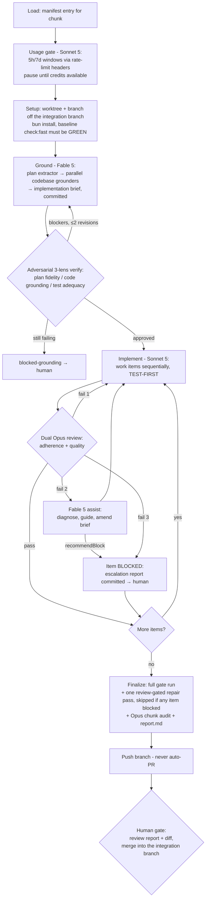

# akm 0.9.0 Execution Workflow — agent teams, test-first, review-gated

**Status:** Adopted 2026-07-14. Companion to `akm-0.9.0-bundle-adapter-architecture-plan.md` (the plan — THE authority; on any conflict this document loses) and derived index `akm-0.9.0-chunk-manifest.json`.
**Machinery:** `.claude/workflows/akm-090-chunk.js` — one workflow invocation executes one plan chunk end-to-end.

## 1. What this is

The 0.9.0 refactor (plan §11: 14 chunks in two waves) is executed by per-chunk agent teams under a test-first, review-gated process with a fixed escalation ladder. One chunk = one workflow run = one branch = one human review. Humans gate between chunks; agents gate within them.

### Roles and models

| Role | Model | Responsibility |
|---|---|---|
| **Grounding architect** | **Opus 4.8** (extractor + author + adversarial verifiers) + **Sonnet 5** (parallel codebase grounders) | Produces the **implementation brief** for the chunk — the plan requirements grounded in the actual code at the chunk's base commit. This is the most critical step: it is what makes each team's work align with the overall plan and produce exactly the code the plan needs. *(Was Fable 5 until 2026-07-15, when the account hit its Fable monthly spend limit — see §8. Grounders were moved to Sonnet, and the remaining architect roles to Opus.)* |
| **Developer** | Sonnet 5 | Implements one work item at a time from the brief, test-first, in the chunk worktree. |
| **Reviewers** (two per item, parallel) | Opus 4.8 | **Adherence reviewer**: strict conformance to the brief (the brief is the contract) incl. test-first commit-order proof and scope discipline. **Quality reviewer**: established code-quality criteria (complexity/function length, DRY, SRP/coupling/dependency direction, naming/idiom, type safety, dead code, error handling, test quality, commit hygiene). Both re-run commands; neither trusts the dev report over the code. |
| **Escalation architect** | Opus 4.8 *(was Fable 5)* | Called when review fails **twice** on an item: diagnoses root cause (dev misread vs brief defect vs reviewer error), issues guidance, may amend the brief. |
| **Chunk auditor / gate runner** | Opus 4.8 / Sonnet 5 | Whole-chunk gate run (`bun run check` + the chunk's manifest gates + the global gates in effect for this chunk + safety suites) and final audit + committed chunk report. A red gate run triggers ONE repair pass — whose commits get the same dual Opus review before the gates re-run; a repair that fails review is left flagged for the human, never silently kept as accepted work. |
| **Usage gate** | Sonnet 5 | Measures the account's Claude Code usage windows (current 5-hour + 7-day) before the chunk starts, before every work item, and before Finalize; pauses the workflow until credits are available. See §6. |
| *Utility agents* | Haiku 4.5 / Sonnet 5 | Manifest load (Haiku); worktree setup and branch push (Sonnet). No development or review decisions. |

### The escalation ladder (per work item)

1. Dev attempt 1 → dual Opus review. Fail → findings go back to the dev.
2. Dev attempt 2 (revise) → dual review. **Fail (review has now failed twice) → Opus escalates to Fable 5** for assistance and clarification. Fable diagnoses, issues guidance, and may amend the brief (or recommend blocking outright if the item is mis-scoped against the plan).
3. Dev attempt 3 (with Fable guidance) → dual review. **Fail → the item is marked BLOCKED and escalated to a human**: a Fable-written escalation report (`docs/design/execution/chunk-<id>/escalation-<item>.md`) is committed on the branch with the unresolved findings verbatim, the root-cause diagnosis, and the specific decisions the maintainer must make. Work-in-progress commits stay in place. Items depending on a blocked item are skipped, the rest of the chunk proceeds.

Review pass rule: `pass = zero blocker + zero major findings`. Blockers: plan-gate or hard-rule violations (anything trust-shaped or lifecycle-shaped in a diff is automatically one — plan §1.3/§12.4), wrong behavior, missing requirements, tests weakened to pass. Minors are recorded in the chunk report and never block.

## 2. Per-chunk lifecycle



Baseline rule: if `check:fast` is red at the chunk base, the run stops immediately (`blocked-baseline`) — nothing can be review-gated against a red baseline.

The usage gate re-runs before **every work item** and before **Finalize**, not just at chunk start — a chunk that begins with headroom can exhaust it mid-run.

**Suite discipline (added 2026-07-14 after the chunk-0a timing analysis):** the full unit suite (~28k tests, 10+ min per run in the sandboxed container) runs exactly **twice per chunk** — the Setup baseline and the Finalize gate. Dev and review agents verify item-scoped only (the item's test files, `bunx tsc --noEmit`, lint on touched files); running `check`/`check:fast`/`test:unit` inside the item loop is prohibited by their prompts. Chunk 0a's first run spent ~5 of its 7.5 hours on 36 in-loop suite runs before this rule existed. Brief authors are likewise directed to 3–5 work items per chunk (per-item fixed overhead is ~20–30 min), batching related captures rather than minting micro-items.

## 3. Test-first protocol (enforced by commit order)

Each brief work item carries a `testMode`; the adherence reviewer verifies compliance from `git log`, not from the dev's claims:

- **test-first** — tests written and committed first (`test(chunk-N):` commit), run and recorded FAILING for the expected reason, then the implementation commit makes them green. Weakening an assertion to pass is a blocker.
- **characterization-preserve** — existing/captured goldens must pass unchanged through the refactor (byte-for-byte where deterministic). Re-recording outside the designated chunk is forbidden (plan §15.5).
- **deletion-gate** — the zero-count grep is the test; the §12.3 replacement contract test lands in the **same commit** as the deletion (plan §15.4).
- **docs-assets** — the lints are the verification (shipped-assets lint, schema regen check, link checks).

## 4. Git conventions

- Integration branch: **`claude/akm-architecture-refactor-fubvd7`** — the branch that carries the plan and this machinery. All chunk work bases from it and merges back into it. No separate integration branch is created.
- Chunk branches: `akm-090/chunk-<id>` off `claude/akm-architecture-refactor-fubvd7`, worked in a dedicated worktree (`/home/user/akm-worktrees/chunk-<id>`). Runs that reach Finalize (`complete | partial | blocked | needs-human`) push the branch — the branch (brief + commits + escalation reports + chunk report) is the human-review artifact. The three pre-Finalize aborts (`blocked-setup`, `blocked-baseline`, `blocked-grounding`) return **without pushing** — there is no report.md for them; the human reviews the structured workflow result directly (for `blocked-grounding`, the last-revision brief is committed in the local worktree). The workflow never opens PRs; the maintainer (or the supervising session, on request) does.
- Commit prefixes: `test(chunk-N):` / `feat(chunk-N):` / `refactor(chunk-N):` / `docs(chunk-N):`.
- Committed artifacts per chunk, on the chunk branch: `docs/design/execution/chunk-<id>/brief.md`, `report.md`, `escalation-*.md` (if any).
- After merge: `git worktree remove /home/user/akm-worktrees/chunk-<id>` to reclaim disk.

## 5. Running it

One chunk per invocation, **in manifest order** (Wave 1: 0a → 7 → 6 → 9; Wave 2: 0b → 1 → 1.5 → 2 → 3 → 4 → 5 → 6.5 → 8 → 10). Chunks are sequential by design — each bases on the integration branch containing all predecessors ("in-branch chunks", plan §11).

```
Workflow({ name: 'akm-090-chunk', args: { chunk: '0a' } })
```

(`baseBranch` defaults to `claude/akm-architecture-refactor-fubvd7`) — or in chat: *"run the akm-090-chunk workflow for chunk 0a"*.

**Batch mode (added 2026-07-14):** consecutive chunks can share one run via `.claude/workflows/akm-090-wave.js` — the plan's "in-branch chunks" model executed literally. One Setup (one `bun install`, one baseline), then the chunks land sequentially on a single wave branch (default: chunks 7, 6, 9 on `akm-090/wave-1`), each with its own full Ground → Verify → Implement/Review → Finalize cycle; each chunk's Finalize gate doubles as the next chunk's green baseline, and the wave **stops at the first non-`complete` chunk** (never building on a red or blocked base). The wave branch is pushed after every chunk's Finalize; the supervising session merges it into the integration branch after review. This saves ~30+ minutes of setup per additional chunk and the idle time between runs. (This runtime does not forward `args` — for a different batch, dispatch a launch copy with the `CHUNK_IDS`/`WAVE_BRANCH` defaults edited.)

Per chunk, in order:
1. Invoke the workflow. It returns a structured result: `status` ∈ `complete | blocked | partial | needs-human | paused-usage | blocked-baseline | blocked-grounding | blocked-setup`.
2. **Human gate:** for `complete | partial | blocked | needs-human`, read `docs/design/execution/chunk-<id>/report.md` on the pushed branch (and any `escalation-*.md`). For `complete`: merge the chunk branch into `claude/akm-architecture-refactor-fubvd7`. For `blocked-setup | blocked-baseline | blocked-grounding` nothing was pushed — read the workflow's returned `detail` instead (and, for `blocked-grounding`, the brief committed in the local worktree). For `paused-usage`: the run exited because a usage window won't reset within the in-run pause bound (see §6); re-run the same chunk after the reset time in `detail` — completed items are preserved on the branch/worktree. In every non-complete case: resolve the escalation questions, then re-run the workflow for the same chunk — it resumes on the existing branch/worktree and re-briefs against the current state (the Workflow tool's `resumeFromRunId` can also replay an interrupted run).
3. Move to the next chunk only after the merge — the next chunk's baseline gate depends on it.

Budget behavior: the workflow stops **starting** new work items when the session token budget runs low and returns `partial` with the remaining items marked `deferred-budget`; re-run the same chunk to continue.

## 6. Usage-window gate (spike-proven 2026-07-14)

**Mechanism.** A Sonnet 5 agent runs a minimal probe — `ANTHROPIC_LOG=debug claude -p --model claude-haiku-4-5-20251001 "Reply with exactly: OK"` — and parses the account-level unified rate-limit headers the API returns (the same windows Claude Code's `/usage` screen shows):

| Header | Meaning |
|---|---|
| `anthropic-ratelimit-unified-status` | overall verdict: `allowed` / `allowed_warning` / `rejected` |
| `anthropic-ratelimit-unified-5h-utilization` / `-5h-reset` | **current 5-hour window**: fraction consumed (0.0–1.0) and unix-epoch reset time |
| `anthropic-ratelimit-unified-7d-utilization` / `-7d-reset` | 7-day window, same semantics |
| `anthropic-ratelimit-unified-representative-claim` | which window is the binding constraint |
| `anthropic-ratelimit-unified-overage-status` | `rejected` = requests hard-fail once a window is exhausted |

**Spike record.** Proven end-to-end in this environment on 2026-07-14: a Sonnet agent ran the probe, extracted the headers, converted fractions to percentages correctly (5h = 40.0% used / 60.0% headroom; 7d = 24.0% used), and produced reset times byte-identical to independently measured ground truth (5h reset `1784021400` → `2026-07-14T09:30:00Z`; 7d reset `1784563200` → `2026-07-20T16:00:00Z`). The debug log redacts the auth header (`authorization: "***"`); gate agents extract only `anthropic-ratelimit-*` fields and delete the log. Caveats: the OAuth `/api/oauth/usage` endpoint is NOT reachable here (no token on disk in remote containers), and local transcript accounting is not authoritative (account-wide usage spans other sessions) — the header probe is the one source that is both available and authoritative.

**Policy.** The gate runs at chunk start, before every work item, and before Finalize. Proceed requires `unified-status = allowed` AND 5h utilization ≤ 90% AND 7d utilization ≤ 97% (override via args `usageCeiling5hPct` / `usageCeiling7dPct`). The ceilings are deliberately early: with `overage-status: rejected`, a window at 100% fails *every* request — including the sleeper agent that implements the pause — so the gate must trip while pausing is still affordable. On a violation: if the limiting window resets within the pause bound (default 6h, covering any 5h-window reset; `maxUsagePauseSeconds` to override), a Sonnet sleeper agent waits it out in ≤10-minute sleeps and the gate re-probes; a longer wait (7-day window) exits the run as `paused-usage` with the reset time — re-run the chunk after it (pair with `send_later` for automatic resumption). A probe that fails twice is treated as possibly-already-exhausted and also exits as `paused-usage` rather than guessing.

## 8. Model-budget lesson — Fable monthly spend limit (2026-07-15)

The workflow originally used **Fable 5** for the grounding architect and escalation roles. During Wave-1 execution the account hit a **Fable 5 monthly spend limit** (`extract:7 failed: You've hit your monthly spend limit … keep using Fable 5 or switch models`). Two things compounded the burn: an all-Fable grounding pipeline (extractor + N grounders + author + 3 verification lenses per chunk, at ~2-wide concurrency in this container), and **two container recycles** that re-paid chunk 7's grounding.

Root-cause note on the usage gate: it measures the **unified 5h/7d rate windows** (which read a comfortable 16% / 57% at the time), not per-model **monthly spend caps** — the two are different meters, and the gate cannot see the one that bit us. The actual safety net that worked is agent-level error handling: the spend-limited extract agent errored, the chunk returned `blocked-grounding`, and the wave stopped cleanly with completed work preserved on the pushed branch.

**Resolution:** all Fable roles were reassigned — codebase grounders → **Sonnet 5**, and extractor / brief author / verification lenses / escalation architect → **Opus 4.8** (reviewers and auditor were already Opus). The workflow now uses no Fable. Cost-reduction changes made alongside: grounding tasks capped at ≤4, and revision-round lenses that approved the prior revision run a cheap low-effort *delta* re-check instead of a full re-run.

## 7. Scope guards baked into every prompt

Every agent in the pipeline carries the plan's hard rules (§1.3) verbatim: no new trust/approval/security machinery; memory lifecycle deferred entirely; deletions gated by inventory + zero-count greps with net-LOC reported, never gated; safety suites green at every boundary; `tests/_helpers/sandbox.ts`, `tests/_preload.ts`, the mock.module ban, and the hand-rolled sharding untouched. The adherence reviewer treats any trust-shaped or lifecycle-shaped addition as an automatic blocker, and the Chunk 6.5 tripwire (>~150 LOC of context-threading → stop and re-scope, §12.4) is in that chunk's manifest gates.
