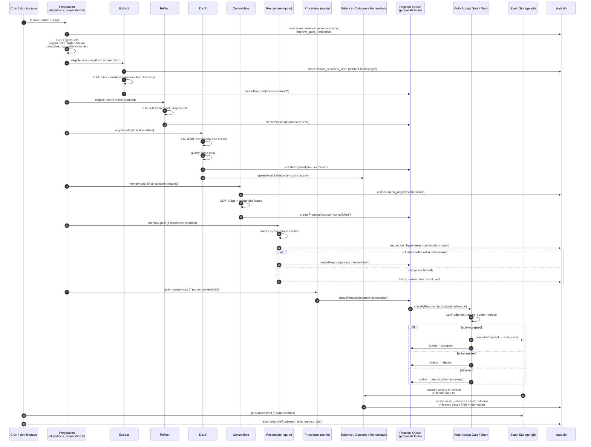

# AKM Improve & Self-Learning — File Map

Comprehensive index of the code, schema, config, tests, and docs that implement
`akm improve` and the broader self-learning loop, generated by parallel
codebase survey. Use this as a starting point when touching improve/salience/
recombine/proposal code — pair it with
[improve-salience-working-reference.md](improve-salience-working-reference.md)
for the deeper mental model.

## Executive summary

`akm improve` is a multi-pass batch job that turns raw session activity into
durable, ranked knowledge assets (memories, lessons, skills), while
continuously re-scoring existing assets so low-value ones decay and
high-value ones surface more often.

**End-to-end shape of one improve cycle:**

1. **Preparation** (`preparation.ts`) resolves the run's scope and profile,
   then builds the eligible-ref set from several independent "lanes":
   signal-delta (recent feedback/proposals), high-retrieval, proactive
   maintenance (stale assets due for review), and high-salience
   (content-scored assets above a threshold). Each ref is tagged with an
   `EligibilitySource` so downstream stages know why it was picked.
2. **Extract** (`extract.ts`) mines new agent-session transcripts for
   candidate memories, gated by a content-hash ledger + watermark so the same
   session is never re-processed twice.
3. **Reflect** (`reflect.ts`) and **Distill** (`distill.ts`) turn eligible
   raw material into structured lesson/memory proposals, running an LLM
   quality judge before proposals are queued.
4. **Consolidate** (`consolidate.ts`) merges near-duplicate or superseded
   memories, using a judged-result cache to avoid re-judging unchanged pairs.
5. **Recombine** (`recombine.ts`, opt-in) clusters memories by shared tags
   and/or graph entities, asks an LLM to generalize a cluster into a
   candidate lesson, and only promotes it to a real proposal after the same
   cluster is confirmed across multiple runs (a hypothesis
   confirmation counter in `recombine_hypotheses`).
6. **Procedural** (`procedural.ts`, opt-in) looks for repeated action
   sequences and compiles them into procedural knowledge.
7. **Salience & outcome scoring** (`salience.ts`, `encoding-salience.ts`,
   `outcome-loop.ts`) computes a three-part score for every touched asset —
   encoding salience (novelty/magnitude/prediction-error at creation time),
   outcome salience (differential usefulness from feedback/retrieval), and
   retrieval salience (recency-decayed usage) — and persists a blended
   `rank_score` to `asset_salience`. Decay of stale, unreviewed assets is
   folded directly into `computeSalience`'s recency term (a floor that itself
   halves every 180 days) rather than a separate demotion pass — the earlier
   standalone `homeostatic.ts` demotion pass was removed (R4, 2026-07-02;
   see `improve-self-learning-analysis.md`).
8. **Proposal gating** (`improve-auto-accept.ts`, `proposal/drain.ts`)
   classifies every proposal produced by the above passes and either
   auto-accepts it (small, high-confidence, trusted source), auto-rejects it
   (empty diff, orphaned ref), or leaves it pending for human review via
   `akm proposal accept|reject`.
9. **Sync** commits accepted changes to the stash's git-backed storage (when
   `sync.enabled`), and the whole run's inputs/outputs are recorded in
   `improve_runs.result_json`/`metrics_json` for later analysis.

The loop is designed to be safe to run unattended and repeatedly: dedup/
cooldown logic in the proposal layer, content-hash ledgers in extract,
confirmation-count gating in recombine, and no-op dampening in salience all
exist specifically to prevent an autonomous cron job from thrashing or
double-counting the same signal.

### End-to-end workflow (Mermaid)

---

## Core Improve Orchestration

- `src/commands/improve/improve.ts:403` — `akmImprove()` main entry point; :340 `renderSyncCommitMessage()`; :366 `armBudgetWatchdog()`; :1247 `emitImproveCompletedEvent()`
- `src/commands/improve/eligibility.ts:25-428` — `resolveImproveScope()`, `collectEligibleRefs()`, `buildLatestFeedbackTsMap()`, `buildLatestProposalTsMap()`, `isSignalDeltaEligible()`, `buildUtilityMap()`
- `src/commands/improve/preparation.ts:101-2300+` — `maybeAutoTuneThreshold()` (101), `runConsolidationPass()` (209), proactive-maintenance selection (1243-1312), high-salience gate (1315-1383), eligibility attribution (1443-1458), unified salience/outcome computation loop (1460-1850+), `runImprovePreparationStage()` (775)
- `src/commands/improve/loop-stages.ts:69,692,863` — `runImproveLoopStage()`, `runImprovePostLoopStage()`, `runImproveMaintenancePasses()`
- `src/commands/improve/improve-auto-accept.ts:148,356` — `runAutoAcceptGate()`, `makeGateConfig()`
- `src/commands/improve/locks.ts:25-124` — `PROCESS_LOCK_DEFS`, `tryAcquireProcessLock()`, `releaseProcessLock()`
- `src/commands/improve/triage.ts:102` — `scoreSessionTriage()`
- `src/commands/improve/eval-cases.ts:46` — `countEvalCases()`
- `src/integrations/agent/prompts.ts:248` — `buildReflectPrompt()`
- `src/core/improve-types.ts:34-71,99-163` — `EligibilitySource` (signal-delta, high-retrieval, high-salience, proactive, scope, forgetting-safety, replay, exploration, recombine, procedural, unknown), `ImproveActionMode`, `classifyImproveAction()`, `ImproveActionResult`

## Passes: Reflect / Distill / Consolidate / Extract

- `src/commands/improve/reflect.ts:86-1000+` — options (86-190), `REFLECT_ALLOWED_TYPES` (258-280), `sanitizeReflectPayload()` (694-822), `REFLECT_JSON_SCHEMA` (823-854), `runReflectViaLlm()` (901-954), `akmReflect()` (955+)
- `src/commands/improve/distill.ts:91-1000+` — `DistillOutcome`/`DISTILL_REFUSED_INPUT_TYPES` (113-141), options (151-225), `deriveLessonRef()` (284-318), `assembleStructuredDistillMarkdown()` (430-534), `buildDistillPrompt()` (535-741), `runLessonQualityJudge()` (742-853), `akmDistill()` (854+), salience upsert call (977)
- `src/commands/improve/distill-promotion-policy.ts:161,989` — `deriveKnowledgeRef()`, `assessMemoryKnowledgePromotionCandidate()`
- `src/commands/improve/consolidate.ts:898,2522` — `akmConsolidate()`, `narrowToIncrementalCandidates()` (the former WS-3b Step 0a homeostatic-demotion call site was removed, R4 2026-07-02)
- `src/commands/improve/consolidate/eligibility.ts` — `isConsolidationEligibleMemoryName()`, `isSessionCaptureMemoryName()` (excludes session-checkpoint telemetry from clustering)
- `src/commands/improve/extract.ts:125-1286` — since-window resolution (125-143), session lock path (145-149), lock acquisition (151-173), options (177-267), result types (269-325), `parseSinceArg()` (326-421), `hashSessionContent()` (422-432, content-hash ledger), `processSession()` (434-781), `akmExtract()` (782-1254), `countNewExtractCandidates()` (1256-1286)
- `src/commands/improve/extract-cli.ts:28-188` — CLI + watch mode
- `src/commands/improve/extract-prompt.ts` — `buildExtractPrompt()`, `parseExtractPayload()`, `EXTRACT_JSON_SCHEMA`
- `src/commands/improve/extract-watch.ts` — session-end hook integration

## Salience / Outcome / Homeostatic (self-learning scoring core)

- `src/commands/improve/salience.ts:1-646` — unified encoding/outcome/retrieval model; projection weights (66-111); `SalienceInputs`/`SalienceVector` (135-238); `computeSalience()` (247-352); `AssetSalienceRow` (359-373); `isContentEncodingRow()` (387-394); `upsertAssetSalience()` (417-450, #644 encoding-source guard); `getAssetSalience()` (455-465); `getAllRankScores()` (476-486); no-op dampening helpers (501-527, 542-543); `buildRankChangeReport()` (576-599); `getLastUseMsByRef()` (619-645)
- `src/commands/improve/encoding-salience.ts:1-259` — novelty×0.40 + magnitude×0.35 + predictionError×0.25 (6-11); weights/floors (15-51); tokenization (55-197); `computeNovelty()`/`computeMagnitude()`/`computePredictionError()` (201-237); `scoreEncodingSalience()` (249-258)
- `src/commands/improve/outcome-loop.ts:1-450` — prediction-error-shaped outcome formula (6-125); `AssetOutcomeRow` (129-139); `updateAssetOutcome()` (197-305, differential update + warm-start); `getAssetOutcome()` (308-315); `getAllAssetOutcomes()` (323-329); `getOutcomeScoresByRefs()` (331-348); `outcomeScoreToSalience()` (353-391); `computeOutcomeCorrelation()` (398-430, quality tripwire)
- `src/commands/improve/homeostatic.ts` — `isSchemaConsistent()`, `applySchemaSimilarityPenalty()`, `checkDistillFidelity()` (the standalone `runHomeostaticDemotion()` pass and `DemotionConfig` were removed 2026-07-02, R4 — decay now lives in `computeSalience`'s recency term)
- `src/commands/improve/proactive-maintenance.ts:36-230` — `DEFAULT_DUE_DAYS`/`DEFAULT_MAX_PER_RUN` (36-37), `selectProactiveMaintenanceRefs()` (121-184), `filterProactiveDue()` (199-230, post-lock cooldown re-filter)

## Recombine / Procedural (entity clustering & synthesis)

- `src/commands/improve/recombine.ts:123-1000+` — options (123-219); `MemoryCluster` (156-161); junk tag/entity filters (177-280); `buildRelatednessClusters()` (302-439, tags/graph/both); `capClusters()` (440-442); `selectClustersForRun()` (468-503, entity/tag blending); `buildClusterPrompt()` (504-532); `deriveRecombineLessonRef()` (533-570); `recombineMemberKey()` (571-620); `parseGeneralization()` (579-593); `akmRecombine()` (621-1000+, cluster→hypothesis→confirm→promote→decay lifecycle)
- `src/commands/improve/procedural.ts:152,330` — `buildSequenceClusters()`, `akmProcedural()`
- `src/indexer/db/db.ts:1492-1555` — `getAllEntries()` (bulk memory pool), `getEntitiesByEntryIds()` (entity lookup for clustering)
- `src/indexer/graph/graph-boost.ts` — search-time graph ranking (context, weights, hop boosts)
- `src/indexer/db/graph-db.ts:39-240` — `withReadableGraphDb()`, `replaceStoredGraph()`

## Memory Capture & Cleanup

- `src/commands/read/remember-cli.ts:44-200+` — `rememberCommand` (CLI interface)
- `src/commands/remember.ts:33-340+` — `MemoryFrontmatterFields` (33-59), `parseDuration()` (60-82), `buildMemoryFrontmatter()` (83-118), `readMemoryContent()` (119-133), `runAutoHeuristics()` (134-172), `detectObservedAt()` (173-198), `runLlmEnrich()` (199-297), `resolveRememberContentArg()` (298+)
- `src/core/write-source.ts` — `writeAssetToSource()` (routes memory creation to asset source)
- `src/commands/improve/memory/memory-improve.ts:12-350+` — prune reasons/belief states (12-36), `analyzeMemoryCleanup()` (127-271), `applyMemoryCleanup()` (272+)
- `src/commands/improve/memory/memory-contradiction-detect.ts:194` — `detectAndWriteContradictions()`
- `src/commands/improve/memory/memory-belief.ts` — belief-state management

## Feedback & Events

- `src/commands/feedback-cli.ts:31-321` — `validateFeedbackTags()` (31-71), `appendLessonStrength()` (73-130), `feedbackCommand` (131-400+), `event_type: "feedback"` (283), `appendEvent()` calls (305-321)
- `src/core/events.ts:45-330` — `EventType` union (45-140), `AppendEventInput`/`EventEnvelope` (139-155), `appendEvent()` (214-256), `readEvents()` (294-330)
- `src/core/state-db.ts:170-411` — `eventRowToEnvelope()` (170-215), `insertEvent()` (309-353), `readStateEvents()` (354-395), `purgeOldEvents()` (396-411, 90-day retention)

## Proposal Queue Lifecycle

- `src/commands/proposal/validators/proposals.ts:95-1526` — `PROPOSAL_SOURCES` allow-list (95-113), `AUTOMATED_PROPOSAL_SOURCES` (116-125), `ProposalStatus`/`Proposal` (197-288), `isProposalSkipped()` (442-445), `createProposal()` (634-752), `checkDedupAndCooldown()` (753-829), `listProposals()` (830-861), `getProposal()` (862-883), `resolveProposalId()` (884-920), `archiveProposal()` (921-967), `recordGateDecision()` (968-997), `purgeOrphanProposals()` (998-1070), `expireStaleProposals()` (1071-1131), `promoteProposal()` (1289-1382), `revertProposal()` (1412-1464), `diffProposal()` (1484-1526)
- `src/commands/proposal/proposal-cli.ts:34-294` — list (34-69), accept incl. F-6 bulk (70-165), reject incl. F-6 bulk (168-277), diff (280-294)
- `src/commands/proposal/proposal.ts:68-231` — `listPendingProposals()` (68-87), `akmProposalAccept()` (134-187), `akmProposalReject()` (188-231)
- `src/commands/proposal/drain.ts:60-704` — `DrainAcceptRule`/`DrainPolicy`/`DrainGateContext` (60-105), `JudgmentVerdict` (157-167), diff-size metrics (182-206), `classifyProposal()` (207-304, size/age/type/source), `buildJudgmentPrompt()` (305-351), `parseJudgmentVerdict()` (352-379), `dispatchJudgment()` (380-437), `drainProposals()` (536-704, main WS-4/F-6 orchestration loop)

## Database Schema (`state.db`, `src/core/state/migrations.ts`)

| Migration | Lines | Table | Purpose |
|---|---|---|---|
| — | 19-61 | `events` | append-only event log (incl. feedback) |
| — | 63-117 | `proposals` | proposal queue (pending/accepted/rejected/reverted) |
| 003 | 226-296 | `improve_runs` | per-run result_json/metrics_json/metadata_json |
| 004 | 298-358 | `extract_sessions_seen` | content-hash ledger for extract dedup |
| 005 | 360-386 | `proposal_fs_imports` | legacy filesystem-import tracking |
| 006 | 395-401 | (index) | proposals pending-ref-source composite index |
| 007 | 403-441 | `consolidation_judged` | judged-pair cache (content_hash keyed) |
| 008 | 443-477 | `body_embeddings` | cached embeddings by content_hash |
| 009 | 479-523 | `asset_salience` | encoding/outcome/retrieval salience, rank_score |
| 010 | 525-577 | `asset_outcome` | retrieval count, feedback count, outcome_score |
| 011 | 578-596 | `asset_salience` +col | `homeostatic_demoted_at` |
| 012 | 597-622 | `improve_gate_thresholds` | per-phase auto-accept thresholds (WS-4) |
| 014 | 643-695 | `recombine_hypotheses` | cluster confirmation-count tracking |
| 015 | 696-720 | `asset_salience` +col | `encoding_source` provenance (content vs type-stub) |

`src/core/state-db.ts` — corresponding CRUD: improve runs (1003-1193: `computeImproveRunMetrics`, `recordImproveRun`, `queryImproveRuns`, `purgeOldImproveRuns`), proposals (413-710: `upsertProposal`, `listStateProposals`, `getStateProposal`, `insertProposalIfAbsent`, `withImmediateTransaction`), extract sessions (1194-1340: `upsertExtractedSession`, `getExtractedSession`, `getLastExtractRunAt`, `shouldSkipAlreadyExtractedSession`), recombine hypotheses (1415-1675: `recordRecombineInduction`, `findMatchingRecombineHypothesis`, `markRecombineHypothesisPromoted`, `decayUnseenRecombineHypotheses`), embeddings (1700-1750+), gate thresholds (520-540), consolidation judged cache (1341-1413).

## Config Schema & Profiles

- `src/core/config/config-schema.ts:154-700+` — `ImproveProcessConfigSchema`/`ImproveProfileConfigSchema` (154-471), top-level `ImproveConfigSchema` (681-689, utilityDecay/eventRetentionDays/calibration/exploration/salience), proactiveMaintenance dueDays (216-219, 424), high-salience threshold (668)
- `src/core/config/config-types.ts:138-158,380-410` — derived TS types for the above
- `src/commands/improve/improve-profiles.ts:1-139` — `BUILTIN_PROFILES` (1-43: default/quick/thorough/memory-focus/graph-refresh/frequent/consolidate/catchup/synthesize), `IMPROVE_PROCESS_DEFAULTS` (53-79, proactiveMaintenance off by default), `resolveProcessEnabled()` (87-95), `resolveImproveProfile()` (118-139)
- `src/assets/profiles/*.json` — `default.json`, `quick.json`, `thorough.json`, `memory-focus.json`, `graph-refresh.json`, `frequent.json`, `consolidate.json`, `catchup.json`, `synthesize.json`

## Tests

- `tests/commands/improve/` — `improve-multi-cycle.test.ts`, `improve-sync.test.ts`, `improve-db-locking.test.ts`, `proactive-maintenance.test.ts`, `proactive-maintenance-flow.test.ts`, `salience.test.ts`, `salience-wiring.test.ts`, `encoding-salience.test.ts`, `feedback-valence.test.ts`, `homeostatic.test.ts`, `outcome-loop.test.ts`, `outcome-loop-wiring.test.ts`, `extract-min-new-sessions.test.ts`, `extract-profile-gate.test.ts`, `extract-triage-gate.test.ts`
- `tests/commands/consolidate/` — `consolidate-all-hot-skip.test.ts`, `consolidate-judged-cache.test.ts`, `consolidate-chunks.test.ts`, `consolidate-eligibility.test.ts`
- `tests/commands/default-improve-profiles.test.ts`, `tests/commands/improve-profiles.test.ts`, `tests/commands/improve-cli-flags.test.ts`
- `tests/state-db/improve-runs.test.ts`, `tests/state-db/recombine-hypotheses.test.ts`
- `tests/recombine-drain-accept.test.ts`, `tests/recombine-tuning.test.ts`
- `tests/proposal-storage-sqlite.test.ts`, `tests/proposals.test.ts`, `tests/proposal-drain.test.ts`, `tests/extract-command.test.ts`

## Documentation

- `docs/design/` — `improve-salience-working-reference.md` (end-to-end mental model, read first), `improve-proactive-maintenance.md` + `-issue.md` (starvation root cause + fix), `improve-optimal-default-config.md` (fresh-install defaults), `improve-beta50-monitoring.md` (beta.50 baseline metrics), `improve-reconciliation-plan-review.md` (blocker review)
- `docs/technical/` — `improve-workflow.md` (command surface + flow diagram), `improve-autosync-investigation.md`
- `docs/archive/` — `improve-vs-brain-analysis.md`, `improve-pipeline-deep-tuning-analysis.md`, `improve-pipeline-analysis-0.8.0.md` (superseded by `improve-self-learning-analysis.md`; archived 2026-07-05)
- `docs/features/improvement-loop.md` — user-facing overview
- `docs/posts/` — `improve-loop-autonomous-10.md`, `improve-pipeline-debugging-0803.md`
- `docs/archive/` — `improve-reconciliation-plan.md`, `0.9.0-improve-tuning-implementation-plan.md`
- `docs/concepts.md`, `docs/cli.md`, `docs/configuration-agent-profiles.md`
