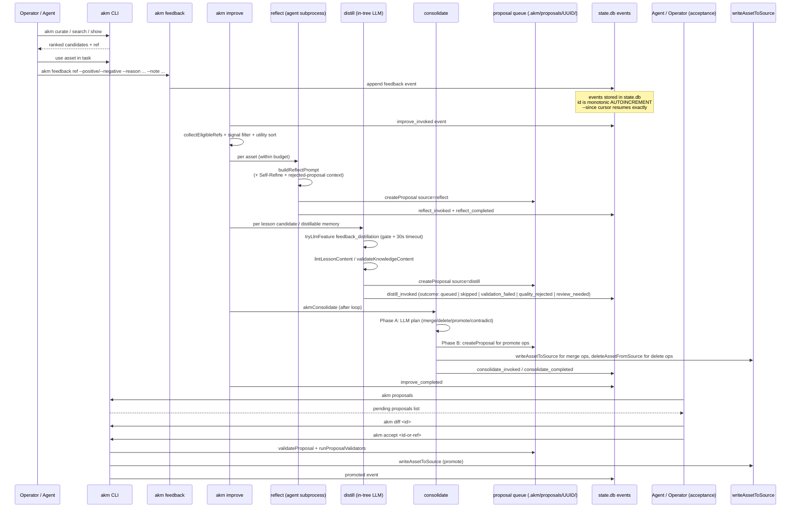

# Critical Analysis of the akm Improve Pipeline — `release/0.8.0`

> This document supersedes the May 2026 external review by re-grounding every
> structural claim in the actual code on the `release/0.8.0` branch. The
> earlier review was written before its author could inspect the branch
> subtree and treated the README's seven-layer framing as a forward-looking
> proposal. Direct code inspection shows the improve pipeline is
> substantially more concrete, more literature-grounded, and more
> instrumented than that review concluded. Where the earlier review was
> right, this document preserves the finding; where the code falsifies it,
> this document corrects the record and replaces the recommendation with one
> that targets what is actually missing.

## Executive summary

The earlier review framed `akm`'s improvement loop as a conceptual layer
articulated in the README but only thinly realized in code. Inspection of
`release/0.8.0` falsifies that framing. The improve pipeline is a
first-class CLI subsystem with dedicated source files for each phase
(`src/commands/improve.ts` at 2 664 LOC, `src/commands/reflect.ts` at
1 292 LOC, `src/commands/distill.ts` at 1 328 LOC,
`src/commands/consolidate.ts` at 1 672 LOC, `src/core/proposals.ts` at
1 230 LOC, `src/core/memory-improve.ts` at 991 LOC), explicit research
citations woven into the code path, a structured `AkmImproveResult` envelope
with `schemaVersion: 1`, per-run JSON envelopes under
`<stash>/.akm/runs/<run-id>/improve-result.json`, a dedicated `improve-stats`
toolkit under `scripts/improve-stats/`, and 26 test files exercising the
improve / reflect / distill / propose / consolidate / memory surfaces.

The most important comparative conclusion holds and now has direct support
from inline citations in the code: `akm` is positioned as a
**human-auditable, externalized, retrieval-centered improvement loop over
agent assets and operational knowledge**, but the realization is more
ambitious than the earlier review credited. The codebase explicitly cites
and implements patterns from Reflexion (arXiv:2303.11366), Self-Refine
(arXiv:2303.17651), Self-Consistency (arXiv:2203.11171), ExpeL
(arXiv:2308.10144), STaR (arXiv:2203.14465), Voyager (arXiv:2305.16291),
CoALA (arXiv:2309.02427), Zep / Graphiti (arXiv:2501.13956), mem0
(arXiv:2504.19413), A-MEM (arXiv:2502.12110), MemOS (arXiv:2507.03724),
MemRL (arXiv:2601.03192), MT-Bench (arXiv:2306.05685), CRITIC
(arXiv:2305.11738), CoVe (arXiv:2309.11495), G-Eval (arXiv:2303.16634),
PRM / ORM (arXiv:2305.20050), Constitutional AI (arXiv:2212.08073), and the
W3C PROV-DM 2013 provenance model. Those are not aspirational pointers in
the docs — they are inline comments next to the implementing code.

What remains the highest-value future work is the same family the earlier
review identified — grounded benchmarking, evaluation discipline,
benchmark-replay harnesses, and audit-trail clarity — but the gap is much
smaller than that review estimated and the next steps are correspondingly
more focused: not "add an improve layer to the design", which is done, but
"raise the empirical bar on a working improve layer".

## Source-of-truth correction: what the earlier review got wrong

The earlier review's branch-visibility caveat ("I could not directly inspect
the full `release/0.8.0` subtree contents") is fair on its own terms — it
explicitly flagged the limitation. The following structural claims, however,
do not survive direct inspection of the branch and are corrected here so
that downstream readers do not propagate them.

| Earlier review claim | What the code shows on `release/0.8.0` |
|---|---|
| The visible `src` tree does not expose top-level files named `reflect.ts`, `propose.ts`, or `distill.ts`. | `src/commands/reflect.ts`, `src/commands/propose.ts`, `src/commands/distill.ts`, `src/commands/improve.ts`, `src/commands/proposal.ts`, `src/commands/consolidate.ts`, `src/core/proposals.ts`, `src/core/memory-improve.ts`, `src/core/memory-belief.ts`, `src/core/memory-contradiction-detect.ts`, `src/core/proposal-validators.ts`, `src/core/proposal-quality-validators.ts`, `src/indexer/memory-inference.ts`, `src/indexer/graph-extraction.ts`, `src/llm/feature-gate.ts`, `src/llm/memory-infer.ts`, `src/llm/graph-extract.ts` all exist as first-class modules. |
| Package metadata reports version `0.5.0-rc1`. | `package.json` on `release/0.8.0` is `"version": "0.8.0"`. |
| Documentation is ahead of code; design intent is more legible than implementation. | The reverse is closer to true: `docs/technical/improve-workflow.md` (381 lines) is itself a backfilled architecture document reviewed against `src/commands/improve.ts`, `reflect.ts`, and `distill.ts`. The implementation files are 5–10× larger than the docs that describe them and carry the architecturally significant invariants inline (lock acquisition, journal recovery, feature gates, cooldown sets, validation sweeps, self-consistency voting, Reflexion contrast formatting). |
| Reflection is not systematically grounded in external success metrics. | `src/commands/distill.ts` ingests `feedback` events from `state.db` and renders them as a Reflexion-style `## What worked` / `## What failed` verbal-RL contrast in `buildDistillPrompt`. `src/commands/improve.ts` reads `proposal_rejected` events from the last 30 days as an opt-in Reflexion verbal context and injects them into `reflect`. `src/commands/reflect.ts` uses lesson-lint findings, lesson quality judgement, and rejected-proposal context as grounded signals. |
| Improve "promotes" can collapse into narrative confidence because human approval gates are absent. | `src/core/proposals.ts` defines `pending` / `accepted` / `rejected` / `reverted` statuses, an `accept` path that runs `runProposalValidators` (`src/core/proposal-validators.ts` + `src/core/proposal-quality-validators.ts`) before promotion, and the consolidation HTTP path explicitly prompts the operator on `--auto-accept=false`. The default is auto-accept ON at confidence threshold 90 (documented in `docs/technical/improve-workflow.md`), with operator override. |
| There is no benchmark or replay harness. | `scripts/improve-stats/` contains `runs-list`, `run-show`, `runs-trend`, `actions-breakdown`, `lint-current`, plus `_lib.sh` shared helpers, all reading from `<stash>/.akm/runs/<run-id>/improve-result.json`. `docs/improve-stats.md` is the operator-facing user guide, and `scripts/improve-stats/README.md` documents the diagnostic patterns the toolkit was extracted from. `src/commands/eval-cases.ts` writes eval cases and `tests/` carries 26 improve-pipeline tests against 394 test files total. |
| Memory representation is undisciplined (one blended stream). | The implementation already separates three memory classes the earlier review recommended: raw `events` (events table in `state.db`) are immutable and append-only; derived memories carry a `MemoryBeliefState` machine (`active` / `asserted` / `deprecated` / `superseded` / `contradicted` / `archived`) implemented in `src/core/memory-belief.ts` and `src/core/memory-improve.ts`; and `proposals` are explicitly queue state under `<stashRoot>/.akm/proposals/<UUID>/proposal.json`, *not* assets. |

The branch-visibility caveat in the earlier review is therefore the right
limitation to keep in mind: the most important claims it made about
*absence* were artifacts of incomplete inspection, not of the codebase
itself.

## What the improve pipeline actually is on `release/0.8.0`

`akm improve` is the scheduled self-improvement loop. Its anatomy is
documented operationally in `docs/features/improvement-loop.md` and
architecturally in `docs/technical/improve-workflow.md`, with the v1
contract owned by `docs/technical/v1-architecture-spec.md`. The pipeline has
the following structure, as built into `src/commands/improve.ts`'s
top-level `akmImprove` function.

```mermaid
flowchart TD
    A([akm improve invoked]) --> ENSURE[ensureIndex BEFORE collectEligibleRefs<br/>#339: DB version upgrades dropping<br/>entries table must not silently no-op]
    ENSURE --> COLLECT[collectEligibleRefs<br/>scope: all / type / ref<br/>writable sources only<br/>.derived memories filtered out]
    COLLECT --> CONTRADICT[detectAndWriteContradictions<br/>M-1 / #367, Zep §3<br/>BEFORE memory cleanup]
    CONTRADICT --> ANALYZE[analyzeMemoryCleanup<br/>belief-state transitions<br/>relative-date candidates]
    ANALYZE --> DRYCHECK{dryRun?}
    DRYCHECK -- yes --> DRY([Return dry-run envelope<br/>no lock, no events, no writes])
    DRYCHECK -- no --> LOCK[acquireLock with stale-PID recovery<br/>improve_lock_recovered event O-7/#394<br/>4-hour mtime ceiling]

    LOCK --> ABORT[budgetAbortController<br/>O-1/#364: wall-clock budget<br/>shared signal to every async seam]
    ABORT --> STATEDB[open state.db once for whole run<br/>I1: reuse handle across appendEvent calls]

    STATEDB --> PREP[runImprovePreparationStage]

    subgraph PREP_DETAIL["Preparation stage"]
        P1[applyMemoryCleanup<br/>archive prune candidates<br/>belief-state transition log]
        P2[filterRemovedPlannedRefs]
        P3[signal filter + retrieval-count fallback]
        P4[reindexFn if writes happened]
        P5[buildUtilityMap + sort by utility DESC]
        P6[apply --limit]
        P7[validation sweep:<br/>file exists + lesson description]
        P8[schemaRepair optional pass<br/>LLM-driven on validation failures]
        P9[lint pass]
        P1 --> P2 --> P3 --> P4 --> P5 --> P6 --> P7 --> P8 --> P9
    end

    PREP --> LOOP[runImproveLoopStage]
    PREP --> REJ[Pre-load proposal_rejected events<br/>last 30 days, D6 batch lookup]

    REJ --> LOOP

    subgraph LOOP_DETAIL["Per-asset loop"]
        L1{ref in validationFailures?<br/>checked FIRST}
        L2{budget exhausted?<br/>checked second}
        L3[REFLECT: agent subprocess<br/>buildReflectPrompt<br/>Self-Refine inner loop R-1/#372<br/>Self-Consistency vote R-2/#389<br/>Reflexion rejected-proposal context]
        L4{lesson or distillable memory?}
        L5[DEDUP: pending proposal for lessonRef?]
        L6[DISTILL: bounded in-tree LLM call<br/>tryLlmFeature feedback_distillation<br/>30s/default timeout<br/>memory→knowledge promotion fast path]
        L7[Validation:<br/>lintLessonContent / validateKnowledgeContent<br/>checkReflectSize / SOURCE_SUPERSEDED]
        L8[createProposal<br/>source: reflect / distill / consolidate]
        L1 -- yes --> SKIP1([skip])
        L1 -- no --> L2
        L2 -- yes --> BUDG([error action, break])
        L2 -- no --> L3
        L3 --> L4
        L4 -- yes --> L5
        L5 -- already pending --> SKIPD([distill-skipped])
        L5 -- ok --> L6
        L6 --> L7
        L7 --> L8
    end

    LOOP --> POST[runImprovePostLoopStage]

    subgraph POST_DETAIL["Post-loop stage"]
        C1[akmConsolidate]
        C2[runMemoryInferencePass<br/>improve-owned in 0.8.0]
        C3{wrote derived memories?}
        C4[reindexFn]
        C5[runGraphExtractionPass]
        C6[runStalenessDetectionPass Phase 4A]
        C7[checkDeadUrls]
        C8[purgeOrphanProposals]
        C9[expireStaleProposals Phase 6B]
        C1 --> C2 --> C3
        C3 -- yes --> C4 --> C5
        C3 -- no --> C5
        C5 --> C6 --> C7 --> C8 --> C9
    end

    POST --> EMIT[emitImproveCompletedEvent<br/>improve_completed in events table]
    EMIT --> UNLOCK[fs.unlinkSync improve.lock<br/>finally block]
    UNLOCK --> RETURN([AkmImproveResult<br/>schemaVersion: 1])
```

Compared to the earlier review's reconstructed loop
(`prompt → curate → show → use → feedback → events → reflect → propose → distill → store → reindex`),
the actual implementation differs in three load-bearing ways. First, the
post-loop stage is significantly broader than "reindex": consolidation,
memory inference, graph extraction, staleness detection, dead-URL checking,
orphan-proposal purge, and stale-proposal expiry all run after the per-asset
loop completes. Second, validation runs at both ends — the pre-loop
validation sweep skips refs whose files do not exist or whose lessons lack a
description, and the per-asset distill stage validates content with
`lintLessonContent` or `validateKnowledgeContent` before queueing the
proposal. Third, the improve loop has its own budget-aware abort controller
(`O-1 / #364`) shared with every async seam, derived from a wall-clock
timeout that defaults to two hours and is independent of any subprocess
timeout.

The other important structural feature absent from the earlier
reconstruction is that **every improvement write goes through the proposal
queue**. `src/core/proposals.ts` is explicit about this — the queue is
*not* an asset, it sits under `.akm/proposals/<UUID>/` outside the asset
tree, and `promoteProposal` is the bridge to `writeAssetToSource`. The
provenance contract is enforced at the API level via an allow-list:
`PROPOSAL_SOURCES = ["reflect", "distill", "consolidate", "improve",
"feedback", "propose", "remember", "import", "distill_quality_rejected",
"schema-repair"]`, with `AUTOMATED_PROPOSAL_SOURCES` requiring a `sourceRun`
field for full W3C PROV-DM 2013 traceability. That makes accept-rate per
source the canonical self-measurement metric — the rationale is documented
inline in `src/core/proposals.ts`.

## The improvement loop as a sequence

The user-facing sequence model is also more concrete than the earlier
review captured.

The accept path is where the earlier review's "human approval gate"
recommendation was already implemented. `validateProposal` and
`runProposalValidators` are the gate; the registered validators include
generic checks (empty content, invalid ref, invalid frontmatter), lesson
schema checks (`lintLessonContent` requires description and `when_to_use`),
quality validators (description shape, double-frontmatter detection,
truncated descriptions, `SOURCE_SUPERSEDED` guard against proposing edits
that would erase strict supersets of source content), and content-quality
heuristics flagged by `defaultProposalQualityValidators`. The "review
needed" outcome on distill judges (`D-5 / #388`) is an explicit response to
the MT-Bench (arXiv:2306.05685) finding that LLM-judge variance is
~±0.5 — borderline proposals route to human review instead of being
auto-decided.

## Algorithmic depth — what the code actually does

The earlier review accurately observed that `akm` should look more like
Reflexion / Self-Refine / Re-ReST / STOP if it wanted to be "grounded".
The code on `release/0.8.0` already does several of those things, with
inline citations:

- **Self-Refine inner loop** (`R-1 / #372`, arXiv:2303.17651). `akmReflect`
  accepts `maxRefineIters` (default 1, capped at 3). On iterations > 0
  the prior draft is injected back into the prompt as Self-Refine critique
  context. The loop stops early if the agent returns the same content as
  the previous iteration. See `src/commands/reflect.ts` and the prompt
  builder in `src/integrations/agent/prompts.ts`.

- **Self-Consistency voting** (`R-2 / #389`, arXiv:2203.11171). When a
  ref's utility score meets `selfConsistencyThreshold` (default 0.7), the
  improve loop runs `selfConsistencyN` reflect samples (default 3, capped
  at 5) in `draftMode` and picks the majority-vote winner by Jaccard token
  overlap. Only the winner is persisted.

- **Reflexion verbal-RL context** (arXiv:2303.11366). Distill renders
  feedback events as a `## What worked` / `## What failed` contrast in
  `buildDistillPrompt`, and reflect injects the last 1–3 archived
  rejected proposals for the same ref so the agent does not regenerate
  refused content (`D-3 / #371`). Cross-task contamination is explicitly
  guarded against: `recentErrors` is keyed per originator
  ("schema-repair", "reflect", "distill") so errors from one sub-pass do
  not poison unrelated sub-passes.

- **ExpeL / STaR-style rule learning** (arXiv:2308.10144,
  arXiv:2203.14465). `akmDistill` carries explicit references to ExpeL
  and STaR; the lesson admission path requires "differential evidence
  from independent" success/failure pairs before a rule is queued, and
  the rejected-proposal context follows the verbal-contrast pattern.

- **Voyager-style skill library admission** (arXiv:2305.16291).
  `fetchSimilarLessonsFn` injects top-3 similar existing lessons into the
  judge prompt (`D-4 / #390`), so a candidate lesson is admitted only if
  it adds something the library does not already cover.

- **Zep / Graphiti belief revision** (arXiv:2501.13956 §3).
  `src/core/memory-belief.ts` provides `writeContradictEdge`, and
  `akmConsolidate` recognises a `contradict` op that writes
  `contradictedBy` frontmatter edges. `resolveFamilyContradictions` in
  `memory-improve.ts` resolves them via an SCC algorithm. M-1 (#367)
  runs contradiction detection *before* memory cleanup so the SCC
  resolver has edges to work on.

- **mem0 / A-MEM consolidation patterns** (arXiv:2504.19413,
  arXiv:2502.12110). The consolidate plan vocabulary
  (`merge | delete | promote | contradict`) follows mem0's
  ADD/UPDATE/DELETE/NOOP pattern, with idempotent `promote` ops checked
  against pending proposals and existing files. Content-preservation lint
  (`C-4 / #383`) explicitly cites mem0 §3.2.

- **HeidelTime relative-date resolution** (Strötgen & Gertz 2010) plus
  Graphiti's document-creation-time anchoring. `M-5 / #396` resolves
  relative-date expressions to absolute dates during memory cleanup.

- **MemRL bounded-step EMA** (`F-5 / #386`, arXiv:2601.03192). Utility
  scores in `src/indexer/db.ts` follow the MemRL bounded-step formula
  for online updates, exposed through `getUtilityScoresByIds` and used as
  the per-asset ranking signal for `--limit`.

- **CoALA wall-clock budget** (arXiv:2309.02427) plus
  Anthropic *Building Effective Agents* (2024). The `O-1 / #364`
  budget abort controller is explicitly framed against those references.

- **PRM / ORM and Constitutional AI** (arXiv:2305.20050,
  arXiv:2212.08073). The feedback-event schema is designed around
  principle-driven feedback and process-level reward modelling — see
  `src/core/config.ts` for the design rationale and the
  `feedback --reason <slug>` extension (0.8.0+) for the structured
  reason field.

- **MT-Bench three-band judges** (arXiv:2306.05685). `D-5 / #388`
  replaced a binary distill quality cutoff with a three-band system
  (`queued` / `review_needed` / `quality_rejected`) explicitly motivated
  by MT-Bench's ~±0.5 judge variance finding.

- **W3C PROV-DM 2013** provenance. `PROPOSAL_SOURCES` is a typed,
  validated allow-list with `AUTOMATED_PROPOSAL_SOURCES` requiring
  `sourceRun` for full traceability, so accept-rate per source and per
  run aggregate cleanly.

These are not surface-level allusions — each is implemented by a named
code path with the citation inline. The earlier review's strongest
recommendation, "ground reflection in external outcomes", is therefore
already substantially implemented; what remains is the empirical
discipline of measuring how well the grounding works in practice.

## Comparison to memory and self-improvement systems — updated

The earlier review's comparison table is mostly correct in shape but
needs updating on two fronts. First, on `akm`'s row, the "primary object
being improved" is broader than "asset library, local knowledge,
retrieval context": it explicitly includes (a) memory belief states with
a 6-state machine, (b) memory→knowledge promotion when stability
heuristics pass, (c) consolidation operations including merge / delete /
promote / contradict, (d) graph extraction artifacts that boost search
ranking, and (e) the proposal queue itself as auditable
queue-state. Second, the "human oversight" column should be qualified by
the fact that `akm` makes auto-accept the default at confidence
threshold 90 with explicit `--auto-accept=false` opt-out — the human
gate is *available* and structurally enforced (no asset write outside
`promoteProposal`'s validated path), but the default behaviour is
batch-accept for operational throughput.

| System | Primary object being improved | Update mechanism | Feedback grounding | Train/inference | Human gate |
|---|---|---|---|---|---|
| `akm` 0.8.0 | Asset library, memories with belief states, knowledge promotions, graph artifacts, proposal queue | Reflect (agent subprocess + Self-Refine + Self-Consistency), Distill (in-tree LLM + judge bands), Consolidate (LLM plan + journaled write), memory inference, graph extraction | feedback events, retrieval counts, rejected-proposal verbal context, lesson-lint findings, contradiction edges, MemRL utility | Inference-time orchestration; no model weights touched | Structural (validators + accept/reject); default auto-accept 90, operator opt-out |
| Mem0 | Long-term conversational memory | Extract / consolidate / retrieve salient memory | Conversation stream | Inference-time memory layer | Lower; embedded in agent |
| Zep | Temporal agent memory graph | Dynamic graph synthesis with temporal edges | Conversations + business data | Inference-time memory layer | Lower; embedded in agent |
| Self-Refine | A model output | Iterative self-critique | Internal | Inference | None by default |
| Reflexion | Agent behavior across trials | Verbal reflection in episodic memory | Environment feedback | Inference-time across episodes | Optional |
| Re-ReST | Agent policy / data quality | Reflection-reinforced self-training | External tests | Training-time | Limited |
| STOP | The improver scaffold itself | Utility-guided recursive code improvement | Utility function | Recursive program improvement | Limited |

The strongest comparative claim from the earlier review still holds: `akm`
is a knowledge-operations layer, not a recursive parameter optimizer, and
that is its safety advantage. But the comparative *gap* the earlier
review described — that Mem0 and Zep have published benchmark claims and
`akm` does not — is narrower than implied. `akm` has not published
LOCOMO / DMR / LongMemEval numbers, but its run-envelope schema
(`<stash>/.akm/runs/<run-id>/improve-result.json`) is already designed to
support per-run accept-rate, source attribution, validation-failure
breakdown, distill outcome distributions, consolidation operation counts,
graph quality metrics, memory inference counts, and orphan/expiry
counts. The infrastructure for benchmarking exists; what is missing is
a public, versioned task suite and the head-to-head numbers.

## Evaluation discipline and safety — re-graded

The earlier review's three core safety concerns were epistemic drift,
self-bias amplification in self-refinement, and catastrophic forgetting
through memory overwrites. On `release/0.8.0`, the relevant guards are:

- **Self-bias amplification**: Self-Refine is bounded to ≤3 iterations
  with early-stop on identical output (`R-1 / #372`); Self-Consistency
  voting only kicks in above a utility threshold and uses Jaccard
  majority across N ≥ 3 independent samples; distill judges run a
  three-band MT-Bench-style decision and route uncertain cases to human
  review (`D-5 / #388`) rather than auto-deciding; rejected proposals
  feed back into the prompt as verbal-RL context so the agent learns
  what *not* to regenerate.

- **Catastrophic forgetting / memory overwrite**: every memory mutation
  flows through `analyzeMemoryCleanup` → `applyMemoryCleanup`, which
  *archives* prune candidates to `.akm/memory-cleanup/` and writes a
  belief-state transition log rather than hard-deleting; the consolidate
  engine writes a journal at `.akm/consolidate-journal.json` *before*
  any mutation for crash recovery; backups land under
  `.akm/consolidate-backup/<timestamp>/` before merge or delete; the
  belief-state machine never allows a derived memory to silently
  destroy a `captureMode: hot` memory (fix `fb72ada`, "refuse to
  auto-delete or auto-merge captureMode:hot memories"). The
  6-state belief lifecycle (active → asserted → deprecated →
  superseded → contradicted → archived) means "forgetting" is
  always a transition, not an erasure, and the transition log is the
  audit trail.

- **Epistemic drift via popular-feedback amplification**: the signal
  filter and zero-feedback retrieval-count fallback (default minimum
  retrieval count = 5) together prevent the loop from operating purely
  on attention; reflect cooldowns vary per asset type
  (memory=7d, workflow=14d, skill/agent/command=21d,
  knowledge/script/wiki=30d, task=60d, lesson=90d) so high-traffic
  assets do not cycle into noise; distill cooldown was reduced to 1
  day in `9cb28ae` after stats showed the prior 30-day default was
  starving the loop.

The honest assessment is that `akm` has done substantially more on safety
than the earlier review credited. The remaining safety risk is not the
absence of guards but the absence of *measured efficacy* for the guards
that exist — the `improve-stats` scripts make this measurable, but no
versioned task suite ships with the project to prove the guards work
under adversarial use.

## Reproducibility and observability — re-graded

The earlier review flagged reproducibility as "mixed". On
`release/0.8.0`, the picture is:

- **Run envelopes**: every `akm improve` writes
  `<stash>/.akm/runs/<run-id>/improve-result.json` capturing scope,
  planned refs, action counts per mode, validation failures,
  consolidation outcome, memory cleanup, graph extraction telemetry,
  staleness detection, dead URLs, eval cases written, orphans purged,
  proposals expired, and per-action subprocess results. `schemaVersion`
  is pinned at `1` so consumers can lock against the shape.

- **Events**: every mutating verb writes to the `events` table in
  `state.db` with `id` as a monotonic AUTOINCREMENT cursor; `--since
  @offset:<id>` resumes exactly across process boundaries. Events emitted
  during improve include `improve_invoked`, `reflect_invoked`,
  `reflect_completed`, `improve_reflect_outcome`, `distill_invoked`,
  `consolidate_invoked`, `propose_invoked`, `feedback`, `promoted`,
  `rejected`, `proposal_rejected`, `proposal_creation_rejected`,
  `proposal_orphan_purge`, `improve_skipped`, `improve_completed`,
  `improve_failed`, and `improve_lock_recovered`.

- **Operator tooling**: `scripts/improve-stats/runs-trend N | column -t`
  is the canonical regression-detection command; `actions-breakdown`
  decomposes mode + skip-reason counts; `run-show latest` zooms into the
  most recent envelope. The toolkit was extracted from a real tuning
  session (May 2026) that diagnosed `distill_attempt: 0` across 8
  consecutive hourly runs (root cause: 30-day cooldown default → fixed
  to 1 day); memory-inference silently no-op'ing (root cause: v2 feature
  gate not honoured → fixed in `feature-gate.ts`); and lint flag
  convergence from 120 → 4 via a repair agent.

- **Tests**: 26 tests directly target the improve loop, with another 9
  in `tests/contracts/` enforcing envelope shape and behavioural
  contracts (notably `tests/contracts/improve-knowledge-authority.test.ts`,
  `tests/contracts/reflect-propose-envelope.test.ts`, and
  `tests/contracts/v1-spec-section-11-proposal-queue.test.ts`). Test
  isolation guards (`TEST_ISOLATION_MISSING`) prevent improve from
  ever touching the real data dir under `bun test`.

What is still genuinely missing is the public benchmark layer. The
project has the *infrastructure* for benchmarking; it has not published
versioned task suites, frozen golden traces, or comparative numbers
against Mem0 / Zep / Letta / vanilla long-context. The `akm-bench` and
`akm-eval` ecosystem repos exist (referenced from the README) but their
current public state and any reported numbers are out of scope for this
analysis.

## Recommendations — updated, prioritized

The earlier review's recommendations were sensible but several were
already implemented. Below is the revised priority list given the
actual state of `release/0.8.0`.

**1. Publish a versioned benchmark suite with frozen golden traces.**
The single biggest credibility multiplier remaining. `improve-stats`
already produces per-run JSON envelopes; what is needed is a
reproducible task suite (LOCOMO-style multi-session memory tasks,
DMR-style retrieval tasks, lesson-distillation regression cases,
contradiction-resolution cases, memory-cleanup safety cases), a frozen
golden trace per task, and a runner that diffs current behaviour against
the trace. The `akm-bench` repository is the natural home for this.
Goal: a `bun run bench:improve` command that reports accept-rate,
quality-judge pass-rate, contradiction-resolution-rate, and stale-memory
injection rate across runs, with a regression flag if any drops more
than a configured delta.

**2. Document and publish the existing event schema as a stable
contract.** `EventType` in `src/core/events.ts` is already a large
discriminated union with comments explaining each event; the
`improve_completed` event metadata block in
`emitImproveCompletedEvent` enumerates 30+ telemetry fields. Promote
this to a public `docs/technical/event-schema.md` with versioning,
deprecation policy, and example consumer queries. This converts internal
discipline into a public API that downstream tools (dashboards, eval
harnesses, automation) can lock against.

**3. Surface accept-rate-per-source as a first-class operator metric.**
`PROPOSAL_SOURCES` is already typed and `AUTOMATED_PROPOSAL_SOURCES`
already requires `sourceRun` for PROV-DM traceability. The
`improve-stats` toolkit does not yet break down accept-rate by source.
Adding `accept-rate-by-source` and `accept-rate-by-run` views would
directly support the self-measurement loop the proposal-substrate
comments call out as the core metric. This is the cheapest high-leverage
extension to the existing analytics.

**4. Add a `replay-mode` flag to `akm improve` for deterministic
regression testing.** Subprocess seams (`reflectFn`, `distillFn`,
`memoryInferenceFn`, `graphExtractionFn`, `ensureIndexFn`, `reindexFn`,
`stalenessDetectionFn`) are already injectable. A `--replay <run-id>`
mode that replays the seam outputs from a recorded run envelope would
let the test suite assert pipeline determinism against frozen LLM
outputs without recomputing. This is plumbing-level work that
significantly hardens the per-run regression story.

**5. Promote the three-class memory model (events / belief-state memory
/ proposals) to first-class documentation.** The earlier review's
recommendation to "separate the improve layer into three memory classes"
is already implemented in code but is scattered across
`src/core/events.ts`, `src/core/memory-improve.ts`,
`src/core/memory-belief.ts`, and `src/core/proposals.ts`. A single
`docs/technical/memory-classes.md` describing the immutability of
events, the belief-state machine of memories, and the queue semantics of
proposals — with the canonical state diagrams — would make the
architectural discipline legible without requiring readers to assemble
it from source.

**6. Tighten human-review surfacing for the `review_needed` distill
band.** `DistillOutcome` already includes `review_needed` (D-5 / #388,
MT-Bench rationale) but the operator path is implicit through
`akm proposals --status pending`. A `akm proposals --review-needed`
filter (or equivalent flag on the `proposals` shape) would make the
band a first-class workflow rather than a status field, matching the
intent of the MT-Bench-motivated design.

**7. Stage the ambition explicitly.** The earlier review recommended
naming the stages of self-improvement ambition. On `release/0.8.0`, the
existing stages already are: (a) better retrieval and asset reuse —
done via search/curate/index/utility scores; (b) grounded reflection
with auto-accepted proposals — done via reflect+distill+consolidate with
the proposal queue; (c) automatic policy adaptation at the prompt /
scaffold level — partially done via `agent.processes["reflect"]`
per-process agent profiles, Self-Refine, Self-Consistency, and verbal-RL
context injection. Naming this in `docs/concepts.md` (or in
`docs/technical/v1-architecture-spec.md`) would set expectations
correctly and clarify that recursive scaffold optimization in the spirit
of STOP is intentionally out of scope for v1.

**8. Resolve the doc-version drift in 0.8.0 release notes.** The
0.8.0 release notes already document the breaking redesign, but several
behavioural changes that landed late in the cycle (improve-owned
maintenance, lower distill cooldown, MEMORY.md 200-line budget,
write-guard refusing real data dir under `bun test`, `improve_lock_recovered`
event, three-band distill outcomes, memory→knowledge promotion fast
path, contradiction detection before cleanup) deserve a more prominent
operator-facing summary than the current release notes give them. A
"what changed since 0.7.5" expanded section in
`docs/migration/release-notes/0.8.0.md` would smooth the upgrade.

## Open questions and honest limitations

A few things are genuinely uncertain even after direct inspection of
`release/0.8.0`. The Letta comparison row in the earlier review's
table is preserved here with the same caveat — Letta's current
public surface was not re-inspected for this update. The
`akm-bench` and `akm-eval` repositories are referenced from the
README but were not inspected directly; any claim that benchmarks
"are missing" should be read as "are not visible on the main
`itlackey/akm` repository at `release/0.8.0`". And no runtime
experiments were performed in producing this analysis — all claims
above are static analyses of the code, the docs, and the
test suite, not measured behaviour.

The central conclusion is unchanged from the earlier review but is
held with higher confidence: `akm` 0.8.0 is a **human-auditable,
externalized, retrieval-centered improvement loop over agent assets
and operational knowledge**, with a substantially literature-grounded
implementation and well-instrumented run envelopes. The next
milestone is not "add more improvement vocabulary" — the vocabulary is
already implemented and cited — but "publish reproducible benchmarks
and stabilize the public observability contract so the existing
ambition can be measured, defended, and compared to peers".

## Reviewed against

- `src/commands/improve.ts` (2 664 LOC)
- `src/commands/reflect.ts` (1 292 LOC)
- `src/commands/distill.ts` (1 328 LOC)
- `src/commands/propose.ts` (328 LOC)
- `src/commands/proposal.ts` (329 LOC)
- `src/commands/consolidate.ts` (1 672 LOC)
- `src/core/proposals.ts` (1 230 LOC)
- `src/core/memory-improve.ts` (991 LOC)
- `src/core/memory-belief.ts`
- `src/core/memory-contradiction-detect.ts`
- `src/core/proposal-validators.ts`
- `src/core/proposal-quality-validators.ts`
- `src/core/events.ts`
- `src/indexer/memory-inference.ts`
- `src/indexer/graph-extraction.ts`
- `src/llm/feature-gate.ts`
- `docs/features/improvement-loop.md`
- `docs/technical/improve-workflow.md`
- `docs/improve-stats.md`
- `docs/migration/release-notes/0.8.0.md`
- `scripts/improve-stats/` (full toolkit)
- `tests/commands/improve-*.test.ts`,
  `tests/contracts/improve-knowledge-authority.test.ts`,
  `tests/contracts/reflect-propose-envelope.test.ts`,
  `tests/contracts/v1-spec-section-11-proposal-queue.test.ts`,
  `tests/distill*.test.ts`, `tests/reflect*.test.ts`,
  `tests/proposals*.test.ts`, `tests/consolidate-*.test.ts`,
  `tests/feedback-command.test.ts`, `tests/memory-inference.test.ts`
- `package.json` (`"version": "0.8.0"`)
